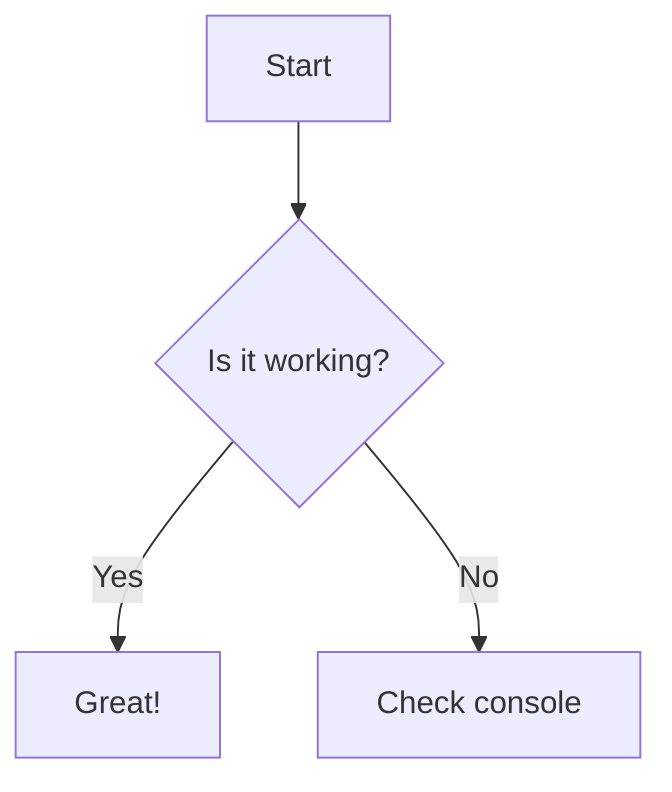

# Styles and Plugins Guide {#main}

This document is a complete reference for all available Markdown features in CrychicDoc, including text formatting, container plugins, and custom Vue components.

## Text Formatting Extensions {#text-formatting-extensions}

These plugins extend standard Markdown syntax to support richer text representation.

### Abbreviations (`abbr`) {#ext-abbr}

Used to create abbreviations for terms.

::: demo Example
*[HTML]: Hyper Text Markup Language
*[W3C]:  World Wide Web Consortium
The HTML specification is maintained by the W3C.
:::

### Superscript and Subscript (`sup` & `sub`) {#ext-sup-sub}

Used to create scripts.

::: demo Example
Subscript: H~2~O
Superscript: 19^th^
:::

### Mark and Insert (`mark` & `ins`) {#ext-mark-ins}

Used to highlight and mark text.

::: demo Example
VuePress Theme Hope ==is very powerful==.
VuePress Theme Hope ++is very++ powerful.
:::

### Ruby Annotation (`ruby`) {#ext-ruby}

Used to add annotations to characters, commonly used in East Asian languages.

::: demo Example
{China:zhōng|guó}
:::

### Spoiler (`spoiler`) {#ext-spoiler}

Creates hidden content that can be clicked to reveal.

::: demo Example
VuePress Theme Hope !!is very powerful!!.
:::

## Content Element Extensions {#content-element-extensions}

These plugins are used to create specific content structures.

### Image Size (`img-size`) {#ext-img-size}

Allows specifying image width and height directly in Markdown image syntax. Add `=widthxheight` after the image alt text.

::: demo Example


:::

### Todo List (`todo`) {#ext-todo}

Creates GitHub-style checkable task lists.

::: demo Example
- [ ] Incomplete task
- [x] Completed task
:::

### Multiple Choice {#multiple-choice}

```markdown
[?] Your question goes here?
[ ] Wrong answer option
[x] Correct answer option (marked with 'x')
[ ] Another wrong answer option
[ ] Yet another wrong answer option
```

[?] Your question goes here?
[ ] Wrong answer option
[x] Correct answer option (marked with 'x')
[ ] Another wrong answer option
[ ] Yet another wrong answer option

## Container Plugins {#container-plugins}

Container plugins use `:::` syntax to create block-level content with special styles or functionality.

### Alignment Container (`align`) {#container-align}

Used to control horizontal alignment of content.

:::: demo Example
::: left
Left-aligned content
:::

::: center
Centered content
:::

::: right
Right-aligned content
:::

::: justify
Justified content
:::
::::

### Tabs (`tabs`) {#container-tabs}

Creates tabs that can switch between multiple panels.

:::: demo Tab Example
:::tabs key:ab
== tab a
a content
== tab b
b content
:::
::::

### Stepper (`stepper`) {#container-stepper}

Creates tabs that visually represent consecutive steps.

:::: demo Example
::: stepper
@tab First Step
This is the first step
@tab Second Step
This is the second step
:::
::::

### Card (`card`) {#container-card}

Creates card containers with multiple styles, can include titles and subtitles.

::::: demo Example
:::text Title#Subtitle
This is text style
:::
:::flat Only Title
This is flat style
:::
:::elevated #Only Subtitle
This is elevated style
:::
:::tonal Title#Subtitle
This is tonal style
:::
:::outlined
This is outlined style, no title or subtitle
:::
::::plain Title#Subtitle
This is plain style  
Only supports double space or `\` for line breaks
:::tonal Nested
Supports nesting, supports !!other plugins!!
:::
::::
:::::

### Demo Container (`demo`) {#container-demo}

Container for showing Markdown examples and their rendered effects.

:::: demo Example
::: demo This is an example
**Markdown** is *awesome*!
:::
::::

### Alert Boxes (`alert` & `v-alert`) {#container-alert}

#### New Alert Box (Recommended) {#alert-new}

Next-generation alert box component with rich configuration options via JSON.

| Property | Type | Description | Optional Values |
|:---|:---|:---|:---|
| `type` | `string` | Alert box type/color | `success`, `info`, `warning`, `error` |
| `title` | `string` | Alert box title | Any string |
| `variant` | `string` | Visual style variant | `flat`, `tonal`, `outlined`, `text`, `plain` |
| `density` | `string` | Spacing density | `default`, `comfortable`, `compact` |
| `border` | `string`\|`boolean` | Border position | `start`, `end`, `top`, `bottom`, `true` |
| `icon` | `string` | Custom Material Design icon | e.g., `mdi-star`, `mdi-heart` |
| `color` | `string` | Custom color | Any color value |
| `lightColor`| `string` | Custom color for light theme | Any color value |
| `darkColor` | `string` | Custom color for dark theme | Any color value |

::::: demo New Alert Box Examples
::: alert {"type": "success", "title": "Success"}
This is a success type alert box.
:::

::: alert {"type": "info", "title": "Information", "icon": "mdi-information"}
This is an info type alert box with custom icon.
:::

::: alert {"type": "warning", "title": "Warning", "variant": "tonal"}
This is a warning type alert box using tonal variant.
:::

::: alert {"type": "error", "title": "Error", "border": "start"}
This is an error type alert box with left border.
:::
:::::

#### Legacy Alert Box (`v-alert`) {#alert-legacy}

Old-style Vuetify-styled alert boxes.

::::: demo Legacy Alert Box Examples
::: v-success Success
This is success style
:::
::: v-info Information
This is info style
:::
::: v-warning Warning
This is warning style
:::
::: v-error Error
This is error style
:::
:::::

### Dialog (`dialog`) {#container-dialog}

Used to create complex dialogs that can be triggered from anywhere.

| Configuration Field | Purpose | Type | Default Value |
|:---|:---|:---|:---|
| `title` | Dialog title | `string` | `N/A` |
| `width` | Dialog maximum width | `string` \| `number` | `800` |
| `fullscreen` | Whether to display in fullscreen mode | `boolean` | `false` |
| `persistent` | Whether clicking outside closes dialog | `boolean` | `false` |

::::: demo Example
@@@ dialog-def#my-dialog {"title": "Dialog Example", "width": 500}
This is a **Markdown** dialog.

- It can contain lists
- `Code blocks`
- And any other Markdown content.
@@@

Click :::dialog#my-dialog here::: to trigger the dialog.
:::::

### Carousels (`carousels`) {#container-carousels}

Creates an image carousel with custom content.

:::: demo Example
::: carousels#{"cycle": true, "interval": 2800, "undelimiters": true}
@tab

@tab

:::
::::

### Embedded External Links (`iframe`) {#container-iframe}

Used to embed external web pages in the page.

| Configuration Field   | Purpose                   | Type           | Default Value    |
| ---------- | ---------------------- | -------------- | --------- |
| `src`      | Web page link, required       | `string`       | `N/A`     |
| `height`   | Set element height.       | `length value` | `140px`   |

:::: demo Example
:::iframes#{"src": "https://misode.github.io/"}
:::
::::

**Note:** Due to security policies, some websites may not allow being embedded and will display blank or error messages.

### Chat Dialog (`chat`) {#container-chat}

Creates simulated chat interface dialog containers, supporting multiple avatar types and message styles.

#### `chat` Container Properties {#chat-container}

| Property | Type | Description | Default Value |
|:---|:---|:---|:---|
| `title` | `string` | Chat panel title | `""` |
| `max-height` | `string` | Maximum height | `"400px"` |

#### `message` Container Properties {#message-container}

| Property | Type | Description | Default Value |
|:---|:---|:---|:---|
| `nickname` | `string` | User nickname | `""` |
| `avatar-type` | `string` | Avatar type | `"icon"` |
| `location` | `string` | Message position | `"left"` |
| `avatar-link` | `string` | Avatar click link | `""` |

#### Avatar Types {#avatar-types}

| Type | Description | Auto Link |
|:---|:---|:---|
| `icon` | Default icon avatar | None |
| `ai` | AI assistant avatar | None |
| `github` | GitHub avatar | Auto link to GitHub profile |

#### Example {#chat-example}

::::: demo AI Conversation Demo
:::: chat title="AI Conversation Demo"
::: message nickname="User" avatar-type="icon"
Hello, can you help me explain what Vue Composition API is?
:::

::: message nickname="AI Assistant" avatar-type="ai" location="right"
Of course! Vue Composition API is a new feature introduced in Vue 3:

- **Reactive data**: Using `ref()` and `reactive()`
- **Lifecycle hooks**: Using `onMounted()` etc.

```javascript
import { ref, onMounted } from 'vue'

export default {
  setup() {
    const count = ref(0)
    
    onMounted(() => {
      console.log('Component mounted')
    })
    
    return { count }
  }
}
```
:::

::: message nickname="octocat" avatar-type="github"
GitHub avatars automatically add links to GitHub profiles
:::
::::
:::::

### Chart Grid (`chart-grid`) {#container-chart-grid}

**Grid layout container specifically optimized for Vue Charts**, providing better side-by-side chart display effects.

| Configuration Field | Purpose | Type | Default Value |
| -------- | ---- | ---- | ------ |
| `columns` | Number of grid columns | `number` | `2` |
| `gap` | Chart spacing | `string` | `"24px"` |
| `responsive` | Whether to enable responsive design | `boolean` | `true` |
| `equalHeight` | Whether to display with equal height | `boolean` | `true` |
| `minHeight` | Minimum height | `string` | `"300px"` |

#### Two Charts Side by Side {#chart-grid-two}

::::: demo Two-column Charts (columns=2)
:::: chart-grid {"columns": 2, "gap": "24px"}

::: chart pie {"title": "Project Progress Distribution", "height": "300px"}
Completed: 65
In Progress: 25
To Start: 10
:::

::: chart line {"title": "Monthly Completion Trend", "height": "300px", "smooth": true}
Monthly Completion | Jan: 20, Feb: 35, Mar: 45, Apr: 65
:::

::::
:::::

::::: demo Single Column Charts (columns=1)
:::: chart-grid {"columns": 1, "gap": "24px"}

::: chart bar {"title": "Team Workload Distribution", "height": "300px"}
Work Distribution | Development: 150, Testing: 80, Documentation: 60, Meetings: 40
:::
::: chart bar {"title": "Team Workload Distribution", "height": "300px"}
Work Distribution | Development: 150, Testing: 80, Documentation: 60, Meetings: 40
:::
::: chart bar {"title": "Team Workload Distribution", "height": "300px"}
Work Distribution | Development: 150, Testing: 80, Documentation: 60, Meetings: 40
:::

::::
:::::

#### Multi-Chart Grid {#chart-grid-multi}

::::: demo Multi-Chart Grid (3 columns)
:::: chart-grid {"columns": 3, "gap": "20px"}

::: chart radar {"title": "Team Skill Assessment", "height": "280px"}
SomeOne | Frontend: 85, Backend: 90, Testing: 75, Documentation: 80, Project Management: 70
:::

::: chart bar {"title": "Monthly Workload Statistics", "height": "280px"}
Workload Statistics | Development: 120, Testing: 80, Documentation: 40, Meetings: 30
:::

::: chart pie {"title": "Project Time Allocation", "height": "280px"}
Frontend Development: 40
Backend Development: 35
Testing Verification: 15
Documentation: 10
:::

::::
:::::

#### Charts and Tables Mixed {#chart-grid-mixed}

::::: demo Charts and Tables Mixed
:::: table-grid {"columns": 2, "gap": "24px"}

::: chart radar {"title": "Skill Assessment", "height": "300px"}
Developer A | Frontend: 85, Backend: 75, Testing: 60, Documentation: 90
Developer B | Frontend: 70, Backend: 95, Testing: 80, Documentation: 65
:::

| Team Member | Main Skills | Years of Experience |
|:---|:---|:---|
| Developer A | Frontend Development | 3 years |
| Developer B | Backend Development | 5 years |
| Test Engineer | Quality Assurance | 4 years |

::::
:::::

### Charts (`chart`) {#charts}

Use `chart` container to render ECharts charts, supporting multiple chart types and rich configuration options.

#### Configuration Options {#chart-config}

| Property | Type | Description | Default Value |
|:---|:---|:---|:---|
| `title` | `string` | Chart main title | `""` |
| `subtitle` | `string` | Chart subtitle | `""` |
| `width` | `string` | Container width | `100%` |
| `height` | `string` | Container height | `400px` |
| `theme` | `string` | Theme | `auto` |
| `legend` | `boolean` | Whether to show legend | `false` |
| `smooth` | `boolean` | Whether to smooth curves (line charts only) | `false` |

#### Supported Chart Types {#chart-types}

| Chart Type | Syntax | Data Format |
|:---|:---|:---|
| **Line Chart** | `line` | `Series Name \| Category1: Value1, Category2: Value2` |
| **Bar Chart** | `bar` | `Series Name \| Category1: Value1, Category2: Value2` |
| **Area Chart** | `area` | `Series Name \| Category1: Value1, Category2: Value2` |
| **Pie Chart** | `pie` | `Category: Value` |
| **Doughnut Chart** | `doughnut` | `Category: Value` |
| **Scatter Plot** | `scatter` | `x-value, y-value` |
| **Radar Chart** | `radar` | `Series Name \| Metric1: Value1, Metric2: Value2` |
| **Gauge** | `gauge` | `Numerical value` |
| **Funnel Chart** | `funnel` | `Category: Value` |
| **Heatmap** | `heatmap` | `x, y, value` |
| **Sankey Diagram** | `sankey` | `Source->Target: Value` |
| **Graph** | `graph` | `Node1->Node2: Value` |
| **Candlestick Chart** | `candlestick`/`k` | `Date: Open,Close,Low,High` |
| **Box Plot** | `boxplot` | `Min,Q1,Median,Q3,Max` |
| **Parallel Coordinates** | `parallel` | `Value1, Value2, Value3, ...` |
| **Theme River** | `themeRiver` | `Date,Category: Value` |
| **Pictorial Bar** | `pictorialBar` | `Category: Value` |

#### Example: Line Chart {#chart-example-line}

::: chart line {"title": "Line Chart", "height": "300px", "smooth": true, "legend": true}
Series A | January: 120, February: 200, March: 150, April: 80
Series B | January: 100, February: 180, March: 130, April: 120
:::

#### Example: Pie Chart {#chart-example-pie}

::: chart pie {"title": "Market Share", "height": "300px"}
Chrome: 65
Firefox: 15
Safari: 12
Edge: 8
:::

#### Example: Radar Chart {#chart-example-radar}

::: chart radar {"title": "Radar Chart", "height": "300px"}
Zhang San | Technology: 90, Communication: 85, Innovation: 88, Management: 75
Li Si | Technology: 80, Communication: 95, Innovation: 70, Management: 90
:::

### Timeline (`timeline`) {#timeline}

Use `timeline` and `timeline-item` containers to create vertical timelines, supporting rich preset types and custom styles.

#### `timeline` Container Properties {#timeline-container}

| Property | Type | Description | Default Value |
|:---|:---|:---|:---|
| `density` | `string` | Timeline density | `default` |
| `direction` | `string` | Direction | `vertical` |

Optional values:
- `density`: `default`, `comfortable`, `compact`
- `direction`: `vertical`, `horizontal`

#### `timeline-item` Container Properties {#timeline-item}

| Property | Type | Description | Default Value |
|:---|:---|:---|:---|
| `type` | `string` | Preset type | `""` |
| `dot-color` | `string` | Dot color | `""` |
| `icon` | `string` | Icon in dot | `""` |
| `opposite` | `string` | Content displayed on opposite side of timeline | `""` |
| `card` | `boolean` | Whether to use card style | `false` |
| `card-title` | `string` | Card title | `""` |

#### Preset Types {#timeline-presets}

| Category | Available Types |
|:---|:---|
| **Basic** | `success`, `info`, `warning`, `error`, `tip` |
| **Project** | `start`, `finish`, `milestone`, `deadline`, `meeting`, `launch`, `pause`, `stop` |
| **Status** | `review`, `approve`, `reject`, `pending`, `progress`, `complete`, `todo`, `doing`, `done` |
| **Bug** | `bug`, `bug_investigating`, `bug_fixed` |
| **Feature** | `feature`, `feature_designing`, `feature_developing`, `feature_testing`, `feature_released` |
| **Task** | `task_created`, `task_assigned`, `task_started`, `task_paused`, `task_resumed`, `task_completed`, `task_cancelled` |
| **Build** | `build_started`, `build_success`, `build_failed` |
| **Deploy** | `deploy`, `deploy_staging`, `deploy_production`, `rollback` |
| **Security** | `security`, `security_issue`, `security_fixed` |
| **Performance** | `performance`, `performance_issue`, `performance_optimized` |
| **Other** | `documentation`, `documentation_updated`, `release`, `hotfix`, `maintenance`, `optimization`, `testing`, `refactor`, `meeting_completed`, `decision_made`, `backup_created`, `user_feedback`, `issue_escalated`, `database_migration`, `api_deprecated`, `dependency_updated` |

#### Example: Project Timeline {#timeline-example}

::::: demo Example
:::: timeline
::: timeline-item type="start" opposite="2024-08"
Project Started
:::
::: timeline-item type="milestone" card="true" card-title="v1.0 Release"
We successfully released the first major version!
:::
::: timeline-item type="refactor" opposite="2025-06"
Sidebar system refactoring completed, started organizing 2.0
:::
::: timeline-item type="task_completed" opposite="2025-07"
Version 2.0 completed
:::
::: timeline-item type="launch" opposite="2025-07"
Documentation still maintained to this day.
:::
::::
:::::

## Code and Chart Plugins {#code-and-chart-plugins}

### Markmap Mind Maps {#markmap}

Use the Markmap plugin to render Markdown content as interactive mind maps.

#### Basic Syntax

````markdown
```markmap
# Topic
## Branch 1
### Sub-branch 1.1
### Sub-branch 1.2
## Branch 2
### Sub-branch 2.1
### Sub-branch 2.2
```
````

#### Rendered Result

```markmap
# Topic
## Branch 1
### Sub-branch 1.1
### Sub-branch 1.2
## Branch 2
### Sub-branch 2.1
### Sub-branch 2.2
```

#### Features

- **Auto-fit**: Mind map automatically adjusts size to fit container
- **Dark mode support**: Automatically adapts to current theme's dark/light mode
- **Interactive**: Support clicking nodes to expand/collapse
- **Colored branches**: Different levels use different colors for distinction

### Magic Move Code Animation {#magic-move}

Used to showcase the gradual evolution of code with highlighted changes.

#### Basic Syntax

````markdown
:::magic-move

```js [js]
const hello = 'world'
```

```ts [ts]
const hello = 'world' as String
```

:::
````

#### Rendered Result

:::magic-move

```js [js]
const hello = 'world'
```

```ts [ts]
const hello = 'world' as String
```

:::

#### Syntax Explanation

- **Container syntax**: Use `:::magic-move` and `:::` to wrap multiple code blocks
- **Filename**: Use `[filename]` in code block info to specify filename
- **Highlight lines**: Use `{1,3-5}` syntax to highlight specific lines
- **Step switching**: Click top tabs to switch between different steps

#### Features

- **Smooth transitions**: Smooth animation effects when code changes
- **Syntax highlighting**: Support syntax highlighting for multiple programming languages
- **File icons**: Automatically display corresponding icons based on file extensions
- **Dark mode**: Automatically adapts to theme mode

## Custom Vue Components {#custom-vue-components}

Vue components that can be used directly in Markdown.

### Mermaid Diagrams {#component-mermaid}

:::demo

:::

### Bilibili Video {#component-bilibili}

:::demo
<BilibiliVideo bvid="BV1rC4y1C7z2" />
:::

### PDF Viewer {#component-pdf-viewer}

:::demo
<PdfViewer pdfSource="/pdf/modding/java/test.pdf"/>
:::