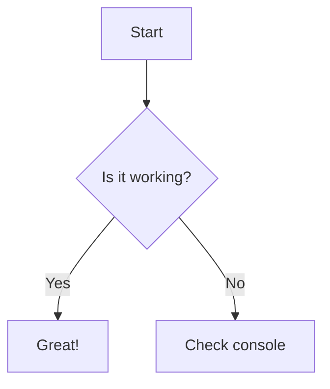

*[HTML]: Hyper Text Markup Language
*[W3C]: World Wide Web Consortium

# Styles & Plugins Guide

This document is a complete specification for all available Markdown features in CrychicDoc, including text formatting, container plugins, and custom Vue components.

## Text Formatting Extensions

These plugins extend standard Markdown syntax for richer text representation.

### Abbreviations (`abbr`)

```markdown
*[HTML]: Hyper Text Markup Language
*[W3C]: World Wide Web Consortium

The HTML specification is maintained by the W3C.
```

**Preview:**

The HTML specification is maintained by the W3C.

---

### Superscript & Subscript (`sup` & `sub`)

```markdown
Subscript: H~2~O
Superscript: 19^th^
```

**Preview:**
Subscript: H~2~O
Superscript: 19^th^

---

### Mark & Insert (`mark` & `ins`)

```markdown
VuePress Theme Hope ==is very powerful==.
VuePress Theme Hope ++is very++ powerful.
```

**Preview:**
VuePress Theme Hope ==is very powerful==.
VuePress Theme Hope ++is very++ powerful.

---

### Ruby Annotation (`ruby`)

```markdown
{中国:zhōng|guó}
```

**Preview:**
{中国:zhōng|guó}

---

### Spoiler

```markdown
VuePress Theme Hope !!is very powerful!!.
```

**Preview:**
VuePress Theme Hope !!is very powerful!!.

---

## Content Element Extensions

### Todo List (`todo`)

```markdown
- [ ] Uncompleted task
- [x] Completed task
```

**Preview:**

- [ ] Uncompleted task
- [x] Completed task

---

### Multiple Choice

```markdown
[?] Your question goes here?
[ ] Wrong answer option
[x] Correct answer option
```

**Preview:**
[?] Your question goes here?
[ ] Wrong answer option
[x] Correct answer option (marked with 'x')
[ ] Another wrong answer option

---

## Container Plugins

Container plugins use `:::` syntax to create block-level content with special styles or functionality.

### Alert (`alert`)

The new alert provides rich configuration options via JSON.

| Property  | Type                | Description          | Values                                       |
| :-------- | :------------------ | :------------------- | :------------------------------------------- |
| `type`    | `string`            | Alert type/color     | `success`, `info`, `warning`, `error`        |
| `title`   | `string`            | Alert title          | Any string                                   |
| `variant` | `string`            | Visual style variant | `flat`, `tonal`, `outlined`, `text`, `plain` |
| `density` | `string`            | Spacing density      | `default`, `comfortable`, `compact`          |
| `border`  | `string`\|`boolean` | Border position      | `start`, `end`, `top`, `bottom`, `true`      |
| `icon`    | `string`            | Custom icon          | e.g. `mdi-star`, `mdi-heart`                 |

**Demo:**

::::: demo Alert Examples
::: alert {"type": "success", "title": "Success"}
This is a success alert.
:::

::: alert {"type": "info", "title": "Info", "icon": "mdi-information"}
This is an info alert with custom icon.
:::

::: alert {"type": "warning", "title": "Warning", "variant": "tonal"}
This is a warning alert with tonal variant.
:::

::: alert {"type": "error", "title": "Error", "border": "start"}
This is an error alert with left border.
:::
:::::

---

### Align Container (`align`)

Control horizontal alignment of content.

**Demo:**

:::: demo Align Examples
::: left
This is left aligned content.
:::

::: center
This is centered content.
:::

::: right
This is right aligned content.
:::
::::

---

### Tabs (`tabs`)

Create switchable tab panels.

**Demo:**

:::: demo Tabs Example
:::tabs key:ab
== tab A
This is content for tab A.
== tab B
This is content for tab B.
:::
::::

---

### Stepper (`stepper`)

Visual step-by-step navigation.

**Demo:**

:::: demo Stepper Example
::: stepper
@tab Step 1
This is step 1 - Set up your project.
@tab Step 2
This is step 2 - Configure dependencies.
@tab Step 3
This is step 3 - Run the project.
:::
::::

---

### Card Container (`card`)

Card containers with multiple styles.

**Demo:**

::::: demo Card Styles
:::text Title#Subtitle
This is text style
:::
:::flat Title Only
This is flat style
:::
:::elevated #Subtitle Only
This is elevated style
:::
:::tonal Title#Subtitle
This is tonal style
:::
:::outlined
This is outlined style
:::
:::::

---

### Timeline (`timeline`)

### Preset Types

| Category | Available Types                                                          |
| :------- | :----------------------------------------------------------------------- |
| Basic    | `success`, `info`, `warning`, `error`, `tip`                             |
| Project  | `start`, `finish`, `milestone`, `deadline`, `meeting`, `launch`          |
| Status   | `review`, `approve`, `reject`, `pending`, `progress`, `complete`         |
| Feature  | `feature`, `feature_designing`, `feature_developing`, `feature_released` |
| Task     | `task_created`, `task_assigned`, `task_started`, `task_completed`        |

**Demo:**

:::: demo Timeline Example
:::: timeline
::: timeline-item type="start" opposite="2024-08"
Project Start
:::
::: timeline-item type="milestone" card="true" card-title="v1.0 Released"
We successfully released the first major version!
:::
::: timeline-item type="refactor" opposite="2025-06"
Sidebar system refactored
:::
::: timeline-item type="finish" opposite="2025-07"
Documentation maintained to date
:::
::::
---

## Chart Containers

### Chart Grid (`chart-grid`)

Grid layout container optimized for Vue Chart.

| Config        | Purpose           | Type      | Default   |
| ------------- | ----------------- | --------- | --------- |
| `columns`     | Grid columns      | `number`  | `2`       |
| `gap`         | Chart gap         | `string`  | `"24px"`  |
| `responsive`  | Enable responsive | `boolean` | `true`    |
| `equalHeight` | Equal height      | `boolean` | `true`    |
| `minHeight`   | Minimum height    | `string`  | `"300px"` |

**Demo:**

::::: demo Two Column Chart
:::: chart-grid {"columns": 2, "gap": "24px"}

::: chart pie {"title": "Project Progress", "height": "300px"}
Completed: 65
In Progress: 25
Pending: 10
:::

::: chart line {"title": "Monthly Trend", "height": "300px", "smooth": true}
Series A | Jan: 20, Feb: 35, Mar: 45, Apr: 65
:::

::::
:::::

**Single Column:**

::::: demo Single Column Chart
:::: chart-grid {"columns": 1, "gap": "24px"}

::: chart bar {"title": "Team Workload", "height": "300px"}
Development: 150, Testing: 80, Documentation: 60, Meetings: 40
:::

::::
:::::

---

### Chart (`chart`)

Use `chart` container to render ECharts charts.

**Supported chart types:**

| Chart Type | Syntax  | Data Format       |
| :--------- | :------ | :---------------- | ------------------------------------- |
| Line       | `line`  | `Series           | Category1: Value1, Category2: Value2` |
| Bar        | `bar`   | `Series           | Category1: Value1, Category2: Value2` |
| Pie        | `pie`   | `Category: Value` |
| Radar      | `radar` | `Series           | Metric1: Value1, Metric2: Value2`     |
| Gauge      | `gauge` | `Value`           |

**Line Chart Demo:**

::: chart line {"title": "Line Chart Example", "height": "300px", "smooth": true}
Series A | Jan: 120, Feb: 200, Mar: 150, Apr: 80
Series B | Jan: 100, Feb: 180, Mar: 130, Apr: 120
:::

**Pie Chart Demo:**

::: chart pie {"title": "Market Share", "height": "300px"}
Chrome: 65
Firefox: 15
Safari: 12
Edge: 8
:::

**Radar Chart Demo:**

::: chart radar {"title": "Skills Assessment"}
Developer A | Frontend: 90, Backend: 85, Testing: 75, Docs: 80
Developer B | Frontend: 70, Backend: 95, Testing: 80, Docs: 65
:::

---

## Code & Chart Plugins

### Markmap Mind Map

Renders Markdown content as interactive mind maps.

````markdown
```markmap
# Topic
## Branch 1
### Sub-branch 1.1
### Sub-branch 1.2
## Branch 2
### Sub-branch 2.1
```
````

**Demo:**

```markmap
# Topic
## Branch 1
### Sub-branch 1.1
### Sub-branch 1.2
## Branch 2
### Sub-branch 2.1
### Sub-branch 2.2
```

---

### Magic Move Code Animation

Shows code evolution with smooth transitions.

**Demo:**

:::magic-move

```js
const hello = "hello";
```

```ts
let world = "world" as String;
```

:::

---

### Shader Syntax Highlighting

Lightweight highlighting for shader code blocks and inline snippets without full parser overhead. Supports `glsl`, `shader`, `hlsl`, and `wgsl` language labels.

````markdown
```glsl
void main() {
    gl_FragColor = vec4(1.0, 0.0, 0.0, 1.0);
}
```

Inline syntax: `shader: vec2 uv = vUv;`
````

**Demo:**

```glsl
void main() {
    gl_FragColor = vec4(1.0, 0.0, 0.0, 1.0);
}
```

Inline syntax: `shader: vec2 uv = vUv;`

### Shader Effect Container (`shader-effect`)

Use a dedicated container when you want the code to drive a live shader canvas directly from Markdown.

````markdown
::: shader-effect{"speed":1}

```glsl
varying vec2 vUv;

void main() {
  vUv = uv;
  gl_Position = projectionMatrix * modelViewMatrix * vec4(position, 1.0);
}
```

```glsl
uniform float uTime;
uniform vec3 uBgColor;
uniform float uThemeIsDark;
uniform vec3 uColor1;
uniform vec3 uColor2;
varying vec2 vUv;

void main() {
  vec2 uv = vUv * 2.0 - 1.0;
  uv.x *= 1.78;
  float r = length(uv);
  float angle = atan(uv.y, uv.x);
  float swirl = angle + uTime * 0.5 + r * 5.0;
  float ring = smoothstep(0.95, 0.15, r);
  float core = smoothstep(0.02, 0.12, r);
  float accretion = sin(swirl * 3.0) * 0.5 + 0.5;
  float glow = exp(-r * 3.0) * 0.6;
  vec3 diskColor = mix(uColor1, uColor2, accretion);
  float effectMask = ring * core;
  vec3 effectColor = diskColor * effectMask + glow * vec3(0.3, 0.4, 0.8);
  vec3 finalColor = mix(uBgColor, effectColor, effectMask + glow * 0.3);
  gl_FragColor = vec4(finalColor, 1.0);
}
```

:::
````

| Field    | Type      | Description                                  | Default |
| -------- | --------- | -------------------------------------------- | ------- |
| `speed`  | `number`  | Animation speed multiplier                   | `1`     |
| `preset` | `string`  | Optional preset fallback (`wave/sunset/...`) | `wave`  |
| `paused` | `boolean` | Pause animation                              | `false` |

**Demo:**

::: shader-effect{"speed":1}

```glsl
varying vec2 vUv;

void main() {
  vUv = uv;
  gl_Position = projectionMatrix * modelViewMatrix * vec4(position, 1.0);
}
```

```glsl
uniform float uTime;
uniform vec3 uBgColor;
uniform float uThemeIsDark;
uniform vec3 uColor1;
uniform vec3 uColor2;
varying vec2 vUv;

void main() {
  vec2 uv = vUv * 2.0 - 1.0;
  uv.x *= 1.78;
  float r = length(uv);
  float angle = atan(uv.y, uv.x);
  float swirl = angle + uTime * 0.5 + r * 5.0;
  float ring = smoothstep(0.95, 0.15, r);
  float core = smoothstep(0.02, 0.12, r);
  float accretion = sin(swirl * 3.0) * 0.5 + 0.5;
  float glow = exp(-r * 3.0) * 0.6;
  vec3 diskColor = mix(uColor1, uColor2, accretion);
  float effectMask = ring * core;
  vec3 effectColor = diskColor * effectMask + glow * vec3(0.3, 0.4, 0.8);
  vec3 finalColor = mix(uBgColor, effectColor, effectMask + glow * 0.3);
  gl_FragColor = vec4(finalColor, 1.0);
}
```

:::

---

## Visual & Utility Plugins

Interactive plugins and embed components that can be used directly in Markdown.

### Mermaid Charts

````markdown

```mermaid
graph TD
    A[Start] --> B{Is it working?};
    B -- Yes --> C[Great!];
    B -- No --> D[Check console];
```
````

**Demo:**


```mermaid
graph TD
    A[Start] --> B{Is it working?};
    B -- Yes --> C[Great!];
    B -- No --> D[Check console];
```

---

### Bilibili Video

```markdown
<BilibiliVideo bvid="BV1rC4y1C7z2" />
```

---

### PDF Viewer

```markdown
<PdfViewer pdfSource="/pdf/modding/java/test.pdf"/>
```

---

### Image Size (`img-size`)

Specify image width and height directly in Markdown image syntax using `=WxH` after the alt text.

```markdown


```

**Demo:**

::: demo Image Size Example

:::

---

### Demo Container (`demo`)

Wraps content in a collapsible demo block that shows the rendered output alongside the source.

```markdown
:::: demo Title
::: demo Inner example
**Markdown** is _awesome_!
:::
::::
```

**Demo:**

:::: demo Demo Container Example
::: demo This is a demo
**Bold**, _italic_, and `inline code` all work here.
:::
::::

---

### Legacy Alert (`v-alert`)

Vuetify-style alerts using the `v-success | v-info | v-warning | v-error` container names.

```markdown
::: v-success Success
This is a success message.
:::

::: v-info Info
This is an info message.
:::

::: v-warning Warning
This is a warning message.
:::

::: v-error Error
This is an error message.
:::
```

**Demo:**

::::: demo Legacy v-alert Examples
::: v-success Success
This is a success message.
:::
::: v-info Info
This is an info message.
:::
::: v-warning Warning
This is a warning message.
:::
::: v-error Error
This is an error message.
:::
:::::

---

### Dialog (`dialog`)

Creates a modal dialog that can be triggered from anywhere on the page.

| Field        | Purpose              | Type             | Default |
| ------------ | -------------------- | ---------------- | ------- |
| `title`      | Dialog title         | `string`         | —       |
| `width`      | Max width            | `string\|number` | `800`   |
| `fullscreen` | Full-screen mode     | `boolean`        | `false` |
| `persistent` | Click-outside closes | `boolean`        | `false` |

```markdown
@@@ dialog-def#my-dialog {"title": "Example Dialog", "width": 500}
This is **Markdown** inside a dialog.
@@@

Click :::dialog#my-dialog here::: to open it.
```

**Demo:**

::::: demo Dialog Example
@@@ dialog-def#demo-dialog {"title": "Hello Dialog", "width": 500}
This is a **Markdown** dialog.

- It can contain lists
- `code blocks`
- And other Markdown content.
  @@@

Click :::dialog#demo-dialog here::: to open the dialog.
:::::

---

### Carousels (`carousels`)

Creates an image or content carousel/slideshow.

#### Accepted Config

| Field            | Purpose                     | Type                | Notes                                 |
| ---------------- | --------------------------- | ------------------- | ------------------------------------- |
| `cycle`          | Auto-play slides            | `boolean`           | Defaults to `false`                   |
| `interval`       | Auto-play interval          | `number`            | Milliseconds                          |
| `hideDelimiters` | Hide bottom dots            | `boolean`           | Preferred key                         |
| `undelimiters`   | Hide bottom dots            | `boolean`           | Legacy alias, still supported         |
| `showArrows`     | Show arrows or hover arrows | `boolean\|\"hover\"` | Preferred key                         |
| `arrows`         | Show arrows or hover arrows | `boolean\|\"hover\"` | Legacy alias, still supported         |
| `continuous`     | Loop when reaching the end  | `boolean`           | Defaults to `true`                    |
| `height`         | Force a fixed carousel size | `string\|number`    | Optional, otherwise height is measured |

#### Syntax

```markdown
::: carousels#{"cycle": true, "interval": 2800, "hideDelimiters": false}
@tab

@tab

:::
```

**Demo:**

#### Content Carousel Demo

:::: demo Content Carousel Example
::: carousels#{"cycle": true, "interval": 3000, "hideDelimiters": false}
@tab
**Slide 1** — You can put any Markdown content here.
@tab
**Slide 2** — Including code, images, and formatted text.
:::
::::

#### Image Carousel Demo

:::: demo Image Carousel Example
::: carousels#{"cycle": true, "interval": 2800, "hideDelimiters": false}
@tab

@tab

:::
::::

---

### Iframe (`iframe`)

Embeds an external web page in the document.

| Field    | Purpose                 | Type     | Default |
| -------- | ----------------------- | -------- | ------- |
| `src`    | URL to embed (required) | `string` | —       |
| `height` | Frame height            | `length` | `140px` |

`src` accepts both standard URLs and Markdown auto-link style values such as `<https://misode.github.io/>`.

#### Syntax

```markdown
:::iframes#{"src": "https://misode.github.io/"}
:::
```

> **Note:** Some sites block embedding via security policies and will display blank or an error.

**Demo:**

:::: demo Iframe Example
:::iframes#{"src": "<https://misode.github.io/>", "height": "300px"}
:::
::::

---

### Theme-Aware Images

Use `.light-only` and `.dark-only` classes to swap screenshots based on the current VitePress theme.

This works with Markdown attribute syntax as well as raw HTML images:

```markdown
{.light-only}
{.dark-only}
```

```html


```

---

### Chat (`chat`)

Creates a simulated chat interface supporting multiple avatar types.

#### `chat` Container Props

| Prop         | Type     | Description      | Default   |
| ------------ | -------- | ---------------- | --------- |
| `title`      | `string` | Chat panel title | `""`      |
| `max-height` | `string` | Max panel height | `"400px"` |

#### `message` Container Props

| Prop          | Type     | Description                         | Default  |
| ------------- | -------- | ----------------------------------- | -------- |
| `nickname`    | `string` | Username                            | `""`     |
| `avatar-type` | `string` | Avatar type: `icon`, `ai`, `github` | `"icon"` |
| `location`    | `string` | Message side: `left`, `right`       | `"left"` |
| `avatar-link` | `string` | Click link on avatar                | `""`     |

#### Syntax

```markdown
:::: chat title="AI Chat Demo"
::: message nickname="User" avatar-type="icon"
Hello! Can you explain what the Vue Composition API is?
:::

::: message nickname="AI Assistant" avatar-type="ai" location="right"
Sure! The Vue Composition API is a new way to organize component logic in Vue 3.
:::
::::
```

**Demo:**

::::: demo Chat Example
:::: chat title="AI Chat Demo"
::: message nickname="User" avatar-type="icon"
Hello! Can you explain what the Vue Composition API is?
:::

::: message nickname="AI Assistant" avatar-type="ai" location="right"
Sure! The Vue Composition API is a new way to organize component logic in Vue 3:

- **Reactive data**: use `ref()` and `reactive()`
- **Lifecycle hooks**: use `onMounted()` etc.

It allows better code reuse compared to the Options API.
:::

::: message nickname="octocat" avatar-type="github"
GitHub avatars auto-link to the user's GitHub profile.
:::
::::
:::::

---

### Steps (`steps`)

Vertical numbered timeline — great for tutorials and how-to guides.

```markdown
::: steps
@tab Step 1 Title
Content for step 1

@tab Step 2 Title
Content for step 2
:::
```

**Demo:**

::: steps
@tab Install Dependencies
Run `npm install` or `yarn install` in the project root.

@tab Start the Dev Server
Run `yarn dev` and open `http://localhost:5173`.

@tab Edit a Page
Edit any `.md` file under `docs/src/` and watch it hot-reload instantly.
:::

---

## Custom Vue Components

### Contributors (`Contributors`)

Fetches and displays GitHub contributors for any repo, grouped by contribution count.

| Prop                | Type            | Description                                         | Default          |
| ------------------- | --------------- | --------------------------------------------------- | ---------------- |
| `owner`             | `string`        | GitHub org/user (auto-detected from project config) | from config      |
| `repo`              | `string`        | Repository name (auto-detected)                     | from config      |
| `maxCount`          | `number`        | Max contributors to show                            | `200`            |
| `showContributions` | `boolean`       | Show contribution counts                            | `true`           |
| `enableCache`       | `boolean`       | Use cached avatars from `/public/contributors/`     | `true`           |
| `title`             | `string`        | Section heading                                     | `"Contributors"` |
| `layout`            | `"doc"\|"hero"` | Force layout mode (auto-detected by default)        | auto             |

```markdown
<Contributors
  owner="PickAID"
  repo="CrychicDoc"
  :max-count="100"
  :show-contributions="true"
  title="Contributors"
/>
```

**Demo:**

<Contributors
  owner="PickAID"
  repo="CrychicDoc"
  :max-count="10"
  :show-contributions="true"
  title="Contributors"
/>

---

### Git Commits Counter (`commitsCounter`)

Displays a sparkline chart of recent commits for a GitHub repository.

| Prop          | Type     | Description                  | Default |
| ------------- | -------- | ---------------------------- | ------- |
| `username`    | `string` | GitHub org/user              | —       |
| `repoName`    | `string` | Repository name              | —       |
| `daysToFetch` | `number` | Number of past days to chart | `30`    |

```markdown
<commitsCounter
  username="PickAID"
  repoName="CrychicDoc"
  :daysToFetch="14"
/>
```

**Demo:**

<commitsCounter
  username="PickAID"
  repoName="CrychicDoc"
  :daysToFetch="14"
/>

---

## Related Links

- [Markdown Extensions Documentation](https://theme-hope.vuejs.org/guide/markdown/overview)
- [Vue Chart Documentation](https://vuechart.wtmcdn.com/)
- [Mermaid Documentation](https://mermaid.js.org/)
