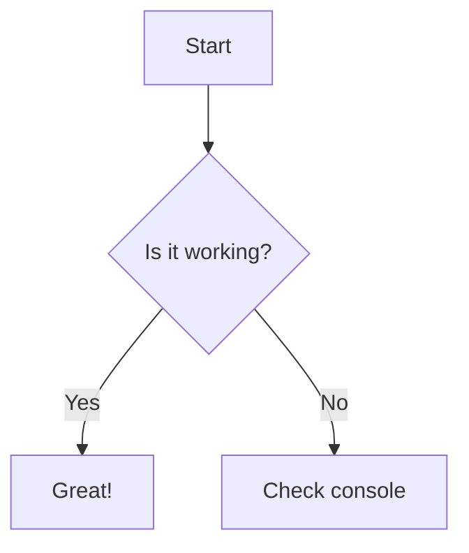

# 样式与插件指南 {#main}

本文档是 CrychicDoc 中所有可用的 Markdown 功能的完整参考，包括文本格式化、容器插件和自定义 Vue 组件。

## 文本格式化扩展 {#text-formatting-extensions}

这些插件扩展了标准的 Markdown 语法，以支持更丰富的文本表示。

### 缩写词 (`abbr`) {#ext-abbr}

用于为术语创建缩写。

::: demo 示例
*[HTML]: Hyper Text Markup Language
*[W3C]:  World Wide Web Consortium
The HTML specification is maintained by the W3C.
:::

### 上标与下标 (`sup` & `sub`) {#ext-sup-sub}

用于创建角标。

::: demo 示例
下角标：H~2~O
上标：19^th^
:::

### 标记与插入 (`mark` & `ins`) {#ext-mark-ins}

用于高亮和标记文本。

::: demo 示例
VuePress Theme Hope ==十分强大==。
VuePress Theme Hope ++十分++ 强大。
:::

### 旁注标记 (`ruby`) {#ext-ruby}

用于为字符添加旁注，常用于东亚语言。

::: demo 示例
{中国:zhōng|guó}
:::

### 隐藏内容 (`spoiler`) {#ext-spoiler}

创建可以点击以显示的隐藏内容。

::: demo 示例
VuePress Theme Hope !!十分强大!!。
:::

## 内容元素扩展 {#content-element-extensions}

这些插件用于创建特定的内容结构。

### 图片尺寸 (`img-size`) {#ext-img-size}

允许在 Markdown 图片语法中直接指定图片的宽高。在图片替代文字后面添加 `=widthxheight`。

::: demo 示例


:::

### 待办清单 (`todo`) {#ext-todo}

创建 GitHub 风格的可勾选任务列表。

::: demo 示例
- [ ] 未完成的任务
- [x] 已完成的任务
:::

### 多选题 {#multiple-choice}

```markdown
[?] Your question goes here?
[ ] Wrong answer option
[x] Correct answer option (marked with 'x')
[ ] Another wrong answer option
[ ] Yet another wrong answer option
```

[?] Your question goes here?
[ ] Wrong answer option
[x] Correct answer option (marked with 'x')
[ ] Another wrong answer option
[ ] Yet another wrong answer option

## 容器插件 {#container-plugins}

容器插件使用 `:::` 语法来创建具有特殊样式或功能的块级内容。

### 对齐容器 (`align`) {#container-align}

用于控制内容的水平对齐方式。

:::: demo 示例
::: left
左对齐的内容
:::

::: center
居中的内容
:::

::: right
右对齐的内容
:::

::: justify
两端对齐的内容
:::
::::

### 选项卡 (`tabs`) {#container-tabs}

创建可以在多个面板之间切换的选项卡。

:::: demo 标签选项卡
:::tabs key:ab
== tab a
a content
== tab b
b content
:::
::::

### 步骤组 (`stepper`) {#container-stepper}

创建一个视觉上表示连续步骤的选项卡。

:::: demo 示例
::: stepper
@tab 第一步
这是第一步
@tab 第二步
这是第二步
:::
::::

### 卡片 (`card`) {#container-card}

创建带有多种样式的卡片容器，可以包含标题和副标题。

::::: demo 示例
:::text 标题#副标题
这是text样式
:::
:::flat 只有标题
这是flat样式
:::
:::elevated #只有副标题
这是elevated样式
:::
:::tonal 标题#副标题
这是tonal样式
:::
:::outlined
这是outlined样式，没有标题和副标题
:::
::::plain 标题#副标题
这是plain样式  
只能使用双空格或`\`换行
:::tonal 嵌套
支持嵌套，支持!!别的插件!!
:::
::::
:::::

### 示例容器 (`demo`) {#container-demo}

用于展示 Markdown 示例及其渲染效果的容器。

:::: demo 示例
::: demo 这是一个示例
**Markdown** is *awesome*!
:::
::::

### 警告框 (`alert` & `v-alert`) {#container-alert}

#### 新版警告框 (推荐) {#alert-new}

新一代的警告框组件，通过 JSON 提供丰富的配置选项。

| 属性 | 类型 | 描述 | 可选值 |
|:---|:---|:---|:---|
| `type` | `string` | 警告框类型/颜色 | `success`, `info`, `warning`, `error` |
| `title` | `string` | 警告框标题 | 任意字符串 |
| `variant` | `string` | 视觉样式变体 | `flat`, `tonal`, `outlined`, `text`, `plain` |
| `density` | `string` | 间距密度 | `default`, `comfortable`, `compact` |
| `border` | `string`\|`boolean` | 边框位置 | `start`, `end`, `top`, `bottom`, `true` |
| `icon` | `string` | 自定义 Material Design 图标 | 如 `mdi-star`, `mdi-heart` |
| `color` | `string` | 自定义颜色 | 任意颜色值 |
| `lightColor`| `string` | 亮色主题下的自定义颜色 | 任意颜色值 |
| `darkColor` | `string` | 暗色主题下的自定义颜色 | 任意颜色值 |

::::: demo 新版警告框示例
::: alert {"type": "success", "title": "成功"}
这是成功类型的警告框。
:::

::: alert {"type": "info", "title": "信息", "icon": "mdi-information"}
这是信息类型的警告框，带有自定义图标。
:::

::: alert {"type": "warning", "title": "警告", "variant": "tonal"}
这是警告类型的警告框，使用 tonal 变体。
:::

::: alert {"type": "error", "title": "错误", "border": "start"}
这是错误类型的警告框，左边有边框。
:::
:::::

#### 传统警告框 (`v-alert`) {#alert-legacy}

旧版的 Vuetify 风格警告框。

::::: demo 传统警告框示例
::: v-success 成功
这是成功样式
:::
::: v-info 提示
这是提示样式
:::
::: v-warning 警告
这是警告样式
:::
::: v-error 错误
这是错误样式
:::
:::::

### 对话框 (`dialog`) {#container-dialog}

用于创建可从任何地方触发的复杂对话框。

| 配置字段 | 用途 | 类型 | 默认值 |
|:---|:---|:---|:---|
| `title` | 对话框的标题 | `string` | `N/A` |
| `width` | 对话框的最大宽度 | `string` \| `number` | `800` |
| `fullscreen` | 是否以全屏模式显示 | `boolean` | `false` |
| `persistent` | 点击外部是否关闭 | `boolean` | `false` |

::::: demo 示例
@@@ dialog-def#my-dialog {"title": "对话框示例", "width": 500}
这是一个 **Markdown** 对话框。

- 它可以包含列表
- `代码块`
- 以及其他任何 Markdown 内容。
@@@

点击 :::dialog#my-dialog 这里::: 来触发对话框。
:::::

### 滚动横幅 (`carousels`) {#container-carousels}

创建一个自定义内容的图片轮播。

:::: demo 示例
::: carousels#{"cycle": true, "interval": 2800, "undelimiters": true}
@tab

@tab

:::
::::

### 内嵌外链 (`iframe`) {#container-iframe}

用于在页面中嵌入外部网页。

| 配置字段   | 用途                   | 类型           | 默认值    |
| ---------- | ---------------------- | -------------- | --------- |
| `src`      | 网页的链接，必填       | `string`       | `N/A`     |
| `height`   | 设置元素的高度。       | `length value` | `140px`   |

:::: demo 示例
:::iframes#{"src": "https://misode.github.io/"}
:::
::::

**注意：** 由于安全策略，某些网站可能不允许被嵌入，会显示空白或错误信息。

### 聊天对话 (`chat`) {#container-chat}

创建模拟聊天界面的对话容器，支持多种头像类型和消息样式。

#### `chat` 容器属性 {#chat-container}

| 属性 | 类型 | 描述 | 默认值 |
|:---|:---|:---|:---|
| `title` | `string` | 聊天面板标题 | `""` |
| `max-height` | `string` | 最大高度 | `"400px"` |

#### `message` 容器属性 {#message-container}

| 属性 | 类型 | 描述 | 默认值 |
|:---|:---|:---|:---|
| `nickname` | `string` | 用户昵称 | `""` |
| `avatar-type` | `string` | 头像类型 | `"icon"` |
| `location` | `string` | 消息位置 | `"left"` |
| `avatar-link` | `string` | 头像点击链接 | `""` |

#### 头像类型 {#avatar-types}

| 类型 | 描述 | 自动链接 |
|:---|:---|:---|
| `icon` | 默认图标头像 | 无 |
| `ai` | AI助手头像 | 无 |
| `github` | GitHub头像 | 自动链接到GitHub主页 |

#### 示例 {#chat-example}

::::: demo AI对话演示
:::: chat title="AI对话演示"
::: message nickname="用户" avatar-type="icon"
你好，能帮我解释一下什么是Vue组合式API吗？
:::

::: message nickname="AI助手" avatar-type="ai" location="right"
当然可以！Vue组合式API是Vue 3中引入的新功能：

- **响应式数据**：使用`ref()`和`reactive()`
- **生命周期钩子**：使用`onMounted()`等

```javascript
import { ref, onMounted } from 'vue'

export default {
  setup() {
    const count = ref(0)
    
    onMounted(() => {
      console.log('组件已挂载')
    })
    
    return { count }
  }
}
```
:::

::: message nickname="octocat" avatar-type="github"
GitHub头像会自动添加链接跳转到GitHub主页
:::
::::
:::::

### 图表网格 (`chart-grid`) {#container-chart-grid}

**专门为 Vue Chart 优化的网格布局容器**，提供更好的图表并列显示效果。

| 配置字段 | 用途 | 类型 | 默认值 |
| -------- | ---- | ---- | ------ |
| `columns` | 网格列数 | `number` | `2` |
| `gap` | 图表间距 | `string` | `"24px"` |
| `responsive` | 是否启用响应式 | `boolean` | `true` |
| `equalHeight` | 是否等高显示 | `boolean` | `true` |
| `minHeight` | 最小高度 | `string` | `"300px"` |

#### 双图表并列 {#chart-grid-two}

::::: demo 双列图表（columns=2）
:::: chart-grid {"columns": 2, "gap": "24px"}

::: chart pie {"title": "项目进度分布", "height": "300px"}
已完成: 65
进行中: 25
待开始: 10
:::

::: chart line {"title": "月度完成趋势", "height": "300px", "smooth": true}
月度完成 | 1月: 20, 2月: 35, 3月: 45, 4月: 65
:::

::::
:::::

::::: demo 单列图表（columns=1）
:::: chart-grid {"columns": 1, "gap": "24px"}

::: chart bar {"title": "团队工作量分布", "height": "300px"}
工作分布 | 开发: 150, 测试: 80, 文档: 60, 会议: 40
:::
::: chart bar {"title": "团队工作量分布", "height": "300px"}
工作分布 | 开发: 150, 测试: 80, 文档: 60, 会议: 40
:::
::: chart bar {"title": "团队工作量分布", "height": "300px"}
工作分布 | 开发: 150, 测试: 80, 文档: 60, 会议: 40
:::

::::
:::::

#### 多图表网格 {#chart-grid-multi}

::::: demo 多图表网格（3列）
:::: chart-grid {"columns": 3, "gap": "20px"}

::: chart radar {"title": "团队技能评估"}
张三 | 前端:85, 后端: 90, 测试: 75, 文档: 80, 项目管理: 70
:::

::: chart bar {"title": "月度工作量统计", "height": "280px"}
工作量统计 | 开发: 120, 测试: 80, 文档: 40, 会议: 30
:::

::: chart pie {"title": "项目时间分配", "height": "280px"}
前端开发: 40
后端开发: 35
测试验证: 15
文档整理: 10
:::

::::
:::::

#### 图表与表格混合 {#chart-grid-mixed}

::::: demo 图表与表格混合
:::: table-grid {"columns": 2, "gap": "24px"}

::: chart radar {"title": "技能评估"}
开发者A | 前端: 85, 后端: 75, 测试: 60, 文档: 90
开发者B | 前端: 70, 后端: 95, 测试: 80, 文档: 65
:::

| 团队成员 | 主要技能 | 经验年限 |
|:---|:---|:---|
| 开发者A | 前端开发 | 3年 |
| 开发者B | 后端开发 | 5年 |
| 测试工程师 | 质量保证 | 4年 |

::::
:::::

### 图表 (`chart`) {#charts}

使用 `chart` 容器来渲染 ECharts 图表，支持多种图表类型和丰富的配置选项。

#### 配置选项 {#chart-config}

| 属性 | 类型 | 描述 | 默认值 |
|:---|:---|:---|:---|
| `title` | `string` | 图表主标题 | `""` |
| `subtitle` | `string` | 图表副标题 | `""` |
| `width` | `string` | 容器宽度 | `100%` |
| `height` | `string` | 容器高度 | `400px` |
| `theme` | `string` | 主题 | `auto` |
| `legend` | `boolean` | 是否显示图例 | `false` |
| `smooth` | `boolean` | 是否平滑曲线（仅折线图） | `false` |

#### 支持的图表类型 {#chart-types}

| 图表类型 | 语法 | 数据格式 |
|:---|:---|:---|
| **折线图** | `line` | `系列名 \| 类别1: 值1, 类别2: 值2` |
| **柱状图** | `bar` | `系列名 \| 类别1: 值1, 类别2: 值2` |
| **面积图** | `area` | `系列名 \| 类别1: 值1, 类别2: 值2` |
| **饼图** | `pie` | `类别: 值` |
| **环形图** | `doughnut` | `类别: 值` |
| **散点图** | `scatter` | `x值, y值` |
| **雷达图** | `radar` | `系列名 \| 指标1: 值1, 指标2: 值2` |
| **仪表盘** | `gauge` | `数值` |
| **漏斗图** | `funnel` | `类别: 值` |
| **热力图** | `heatmap` | `x, y, 值` |
| **桑基图** | `sankey` | `源->目标: 值` |
| **关系图** | `graph` | `节点1->节点2: 值` |
| **K线图** | `candlestick`/`k` | `日期: 开盘,收盘,最低,最高` |
| **箱线图** | `boxplot` | `最小值,下四分位,中位数,上四分位,最大值` |
| **平行坐标** | `parallel` | `值1, 值2, 值3, ...` |
| **主题河流** | `themeRiver` | `日期,类别: 值` |
| **象形柱图** | `pictorialBar` | `类别: 值` |

#### 示例：折线图 {#chart-example-line}

::: chart line {"title": "折线图", "height": "300px", "smooth": true, "legend": true}
系列A | 一月: 120, 二月: 200, 三月: 150, 四月: 80
系列B | 一月: 100, 二月: 180, 三月: 130, 四月: 120
:::

#### 示例：饼图 {#chart-example-pie}

::: chart pie {"title": "市场份额", "height": "300px"}
Chrome: 65
Firefox: 15
Safari: 12
Edge: 8
:::

#### 示例：雷达图 {#chart-example-radar}

::: chart radar {"title": "雷达图"}
张三 | 技术: 90, 沟通: 85, 创新: 88, 管理: 75
李四 | 技术: 80, 沟通: 95, 创新: 70, 管理: 90
:::

### 时间线 (`timeline`) {#timeline}

使用 `timeline` 和 `timeline-item` 容器来创建垂直时间线，支持丰富的预设类型和自定义样式。

#### `timeline` 容器属性 {#timeline-container}

| 属性 | 类型 | 描述 | 默认值 |
|:---|:---|:---|:---|
| `density` | `string` | 时间线密度 | `default` |
| `direction` | `string` | 方向 | `vertical` |

可选值：
- `density`: `default`, `comfortable`, `compact`
- `direction`: `vertical`, `horizontal`

#### `timeline-item` 容器属性 {#timeline-item}

| 属性 | 类型 | 描述 | 默认值 |
|:---|:---|:---|:---|
| `type` | `string` | 预设类型 | `""` |
| `dot-color` | `string` | 圆点颜色 | `""` |
| `icon` | `string` | 圆点内的图标 | `""` |
| `opposite` | `string` | 显示在时间线对侧的内容 | `""` |
| `card` | `boolean` | 是否使用卡片样式 | `false` |
| `card-title` | `string` | 卡片标题 | `""` |

#### 预设类型 {#timeline-presets}

| 类别 | 可用类型 |
|:---|:---|
| **基础** | `success`, `info`, `warning`, `error`, `tip` |
| **项目** | `start`, `finish`, `milestone`, `deadline`, `meeting`, `launch`, `pause`, `stop` |
| **状态** | `review`, `approve`, `reject`, `pending`, `progress`, `complete`, `todo`, `doing`, `done` |
| **Bug** | `bug`, `bug_investigating`, `bug_fixed` |
| **功能** | `feature`, `feature_designing`, `feature_developing`, `feature_testing`, `feature_released` |
| **任务** | `task_created`, `task_assigned`, `task_started`, `task_paused`, `task_resumed`, `task_completed`, `task_cancelled` |
| **构建** | `build_started`, `build_success`, `build_failed` |
| **部署** | `deploy`, `deploy_staging`, `deploy_production`, `rollback` |
| **安全** | `security`, `security_issue`, `security_fixed` |
| **性能** | `performance`, `performance_issue`, `performance_optimized` |
| **其他** | `documentation`, `documentation_updated`, `release`, `hotfix`, `maintenance`, `optimization`, `testing`, `refactor`, `meeting_completed`, `decision_made`, `backup_created`, `user_feedback`, `issue_escalated`, `database_migration`, `api_deprecated`, `dependency_updated` |

#### 示例：项目时间线 {#timeline-example}

::::: demo 示例
:::: timeline
::: timeline-item type="start" opposite="2024-08"
项目启动
:::
::: timeline-item type="milestone" card="true" card-title="v1.0 发布"
我们成功发布了第一个主要版本！
:::
::: timeline-item type="refactor" opposite="2025-06"
Sidebar系统完成重构，开始整理2.0
:::
::: timeline-item type="task_completed" opposite="2025-07"
2.0版本完成
:::
::: timeline-item type="launch" opposite="2025-07"
文档仍维护至今。
:::
::::
:::::

## 代码与图表插件 {#code-and-chart-plugins}

### Markmap 思维导图 {#markmap}

使用 Markmap 插件可以将 Markdown 内容渲染为交互式思维导图。

#### 基本语法

````markdown
```markmap
# 主题
## 分支 1
### 子分支 1.1
### 子分支 1.2
## 分支 2
### 子分支 2.1
### 子分支 2.2
```
````

#### 渲染效果

```markmap
# 主题
## 分支 1
### 子分支 1.1
### 子分支 1.2
## 分支 2
### 子分支 2.1
### 子分支 2.2
```

#### 特性

- **自动适应**：思维导图会自动调整大小以适应容器
- **深色模式支持**：自动适配当前主题的深色/浅色模式
- **交互式**：支持点击节点展开/折叠
- **彩色分支**：不同层级使用不同颜色区分

### Magic Move 代码动画 {#magic-move}

用于展示代码的逐步演变过程，支持高亮变化部分。

#### 基本语法

````markdown
:::magic-move

```js [js]
const hello = 'world'
```

```ts [ts]
const hello = 'world' as String
```

:::
````

#### 渲染效果

:::magic-move

```js [js]
const hello = 'hello'
```

```ts [ts]
let world = 'world' as String
```

:::

#### 语法说明

- **容器语法**：使用 `:::magic-move` 和 `:::` 包裹多个代码块
- **文件名**：在代码块信息中使用 `[filename]` 指定文件名
- **高亮行**：使用 `{1,3-5}` 语法高亮特定行
- **步骤切换**：点击顶部标签页切换不同步骤

#### 特性

- **平滑过渡**：代码变化时有平滑的动画效果
- **语法高亮**：支持多种编程语言的语法高亮
- **文件图标**：根据文件扩展名自动显示对应图标
- **深色模式**：自动适配主题模式

## 自定义 Vue 组件 {#custom-vue-components}

可以直接在 Markdown 中使用的 Vue 组件。

### Mermaid 图表 {#component-mermaid}

:::demo

:::

### Bilibili 视频 {#component-bilibili}

:::demo
<BilibiliVideo bvid="BV1rC4y1C7z2" />
:::

### PDF 查看器 {#component-pdf-viewer}

:::demo
<PdfViewer pdfSource="/pdf/modding/java/test.pdf"/>
:::
