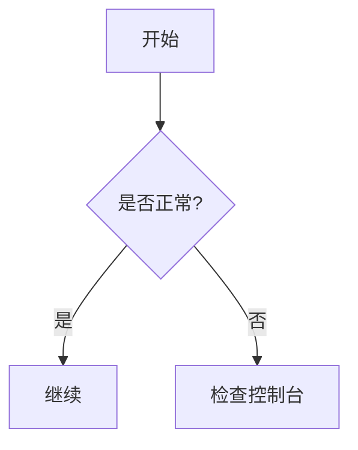

*[HTML]: Hyper Text Markup Language
*[W3C]: World Wide Web Consortium

# 样式与插件指南

本文档是 CrychicDoc 中所有可用的 Markdown 功能的完整参考，包括文本格式化、容器插件和自定义 Vue 组件。

## 文本格式化扩展

这些插件扩展了标准的 Markdown 语法，以支持更丰富的文本表示。

### 缩写词 (`abbr`)

```markdown
*[HTML]: Hyper Text Markup Language
*[W3C]: World Wide Web Consortium

The [HTML] specification is maintained by the [W3C].
```

**预览：**

The [HTML] specification is maintained by the [W3C].

---

### 上标与下标 (`sup` & `sub`)

```markdown
下角标：H~2~O
上标：19^th^
```

**预览：**
下角标：H~2~O
上标：19^th^

---

### 标记与插入 (`mark` & `ins`)

```markdown
VuePress Theme Hope ==十分强大==。
VuePress Theme Hope ++十分++ 强大。
```

**预览：**
VuePress Theme Hope ==十分强大==。
VuePress Theme Hope ++十分++ 强大。

---

### 旁注标记 (`ruby`)

```markdown
{中国:zhōng|guó}
```

**预览：**
{中国:zhōng|guó}

---

### 隐藏内容 (`spoiler`)

```markdown
VuePress Theme Hope !!十分强大!!。
```

**预览：**
VuePress Theme Hope !!十分强大!!。

---

## 内容元素扩展

### 图片尺寸 (`img-size`)

在 Markdown 图片语法中，于替代文字后添加 `=宽x高` 来直接指定宽高。

```markdown


```

**演示：**

::: demo 图片尺寸示例

:::

---

### 待办清单 (`todo`)

```markdown
- [ ] 未完成的任务
- [x] 已完成的任务
```

**预览：**

- [ ] 未完成的任务
- [x] 已完成的任务

---

### 多选题

```markdown
[?] Your question goes here?
[ ] Wrong answer option
[x] Correct answer option
```

**预览：**
[?] Your question goes here?
[ ] Wrong answer option
[x] Correct answer option (marked with 'x')
[ ] Another wrong answer option

---

## 容器插件

容器插件使用 `:::` 语法来创建具有特殊样式或功能的块级内容。

### 警告框 (`alert`)

新版警告框通过 JSON 提供丰富的配置选项。

| 属性      | 类型                | 描述            | 可选值                                       |
| :-------- | :------------------ | :-------------- | :------------------------------------------- |
| `type`    | `string`            | 警告框类型/颜色 | `success`, `info`, `warning`, `error`        |
| `title`   | `string`            | 警告框标题      | 任意字符串                                   |
| `variant` | `string`            | 视觉样式变体    | `flat`, `tonal`, `outlined`, `text`, `plain` |
| `density` | `string`            | 间距密度        | `default`, `comfortable`, `compact`          |
| `border`  | `string`\|`boolean` | 边框位置        | `start`, `end`, `top`, `bottom`, `true`      |
| `icon`    | `string`            | 自定义图标      | 如 `mdi-star`, `mdi-heart`                   |

**演示：**

::::: demo 警告框示例
::: alert {"type": "success", "title": "成功"}
这是成功类型的警告框。
:::

::: alert {"type": "info", "title": "信息", "icon": "mdi-information"}
这是信息类型的警告框，带有自定义图标。
:::

::: alert {"type": "warning", "title": "警告", "variant": "tonal"}
这是警告类型的警告框，使用 tonal 变体。
:::

::: alert {"type": "error", "title": "错误", "border": "start"}
这是错误类型的警告框，左边有边框。
:::
:::::

---

### 对齐容器 (`align`)

用于控制内容的水平对齐方式。

**演示：**

:::: demo 对齐示例
::: left
这是左对齐的内容。
:::

::: center
这是居中的内容。
:::

::: right
这是右对齐的内容。
:::
::::

---

### 选项卡 (`tabs`)

创建可以在多个面板之间切换的选项卡。

**演示：**

:::: demo 标签选项卡
:::tabs key:ab
== tab A
这是 A 选项卡的内容。
== tab B
这是 B 选项卡的内容。
:::
::::

---

### 步骤组 (`stepper`)

创建一个视觉上表示连续步骤的选项卡。

**演示：**

:::: demo 步骤示例
::: stepper
@tab 第一步
这是第一步 - 开始设置项目。
@tab 第二步
这是第二步 - 配置依赖。
@tab 第三步
这是第三步 - 运行项目。
:::
::::

---

### 卡片容器 (`card`)

创建带有多种样式的卡片容器。

**演示：**

::::: demo 卡片样式
:::text 标题#副标题
这是text样式
:::
:::flat 只有标题
这是flat样式
:::
:::elevated #只有副标题
这是elevated样式
:::
:::tonal 标题#副标题
这是tonal样式
:::
:::outlined
这是outlined样式
:::
:::::

---

### 示例容器 (`demo`)

将内容包裹在可折叠的演示块中，同时显示渲染效果。

```markdown
:::: demo 标题
::: demo 内部示例
**Markdown** 很强大！
:::
::::
```

**演示：**

:::: demo 示例容器演示
::: demo 这是一个示例
**加粗**、_斜体_ 和 `行内代码` 都可以正常使用。
:::
::::

---

### 传统警告框 (`v-alert`)

Vuetify 风格的旧版警告框，使用 `v-success | v-info | v-warning | v-error` 容器名称。

```markdown
::: v-success 成功
这是成功样式。
:::

::: v-info 提示
这是提示样式。
:::
```

**演示：**

::::: demo 传统警告框示例
::: v-success 成功
这是成功样式。
:::
::: v-info 提示
这是提示样式。
:::
::: v-warning 警告
这是警告样式。
:::
::: v-error 错误
这是错误样式。
:::
:::::

---

### 对话框 (`dialog`)

创建可从页面任意位置触发的模态对话框。

| 配置字段     | 用途             | 类型             | 默认值  |
| ------------ | ---------------- | ---------------- | ------- |
| `title`      | 对话框标题       | `string`         | —       |
| `width`      | 最大宽度         | `string\|number` | `800`   |
| `fullscreen` | 是否全屏         | `boolean`        | `false` |
| `persistent` | 点击外部是否关闭 | `boolean`        | `false` |

```markdown
@@@ dialog-def#my-dialog {"title": "对话框示例", "width": 500}
这是 **Markdown** 对话框内容。
@@@

点击 :::dialog#my-dialog 这里::: 打开对话框。
```

**演示：**

::::: demo 对话框示例
@@@ dialog-def#zh-demo-dialog {"title": "你好，对话框", "width": 500}
这是一个 **Markdown** 对话框。

- 可以包含列表
- `代码块`
- 以及其他 Markdown 内容。
  @@@

点击 :::dialog#zh-demo-dialog 这里::: 打开对话框。
:::::

---

### 滚动横幅 (`carousels`)

创建图片或自定义内容的轮播组件。

#### 支持配置

| 字段             | 用途                 | 类型                  | 说明                       |
| ---------------- | -------------------- | --------------------- | -------------------------- |
| `cycle`          | 自动轮播             | `boolean`             | 默认为 `false`             |
| `interval`       | 自动轮播间隔         | `number`              | 单位为毫秒                 |
| `hideDelimiters` | 隐藏底部分页点       | `boolean`             | 推荐使用的字段名           |
| `undelimiters`   | 隐藏底部分页点       | `boolean`             | 兼容旧字段，仍然支持       |
| `showArrows`     | 显示箭头或悬停箭头   | `boolean\|\"hover\"`  | 推荐使用的字段名           |
| `arrows`         | 显示箭头或悬停箭头   | `boolean\|\"hover\"`  | 兼容旧字段，仍然支持       |
| `continuous`     | 到末尾后继续循环     | `boolean`             | 默认为 `true`              |
| `height`         | 强制指定固定高度     | `string\|number`      | 不填时将自动测量内容高度   |

#### 基本语法

```markdown
::: carousels#{"cycle": true, "interval": 3000, "hideDelimiters": false}
@tab

@tab

@tab

:::
```

**演示：**

#### 图片轮播演示

:::: demo 图片轮播示例
::: carousels#{"cycle": true, "interval": 3000, "hideDelimiters": false}
@tab

@tab

@tab

:::
::::

---

### 内容轮播 (`carousels`)

轮播组件也可以放置任意 Markdown 内容。

#### 内容轮播语法

```markdown
::: carousels#{"cycle": false}
@tab
**第一张幻灯片** — 可以放任意 Markdown 内容。
@tab
**第二张幻灯片** — 包括代码、图片和格式化文本。
@tab
## 第三张幻灯片
- 列表项 1
- 列表项 2
:::
```

**演示：**

#### 内容轮播演示

:::: demo 内容轮播示例
::: carousels#{"cycle": false}
@tab
**第一张幻灯片** — 可以放任意 Markdown 内容。
@tab
**第二张幻灯片** — 包括代码、图片和格式化文本。

- 列表项 1
- 列表项 2
@tab

## 第三张幻灯片

- 列表项 1
- 列表项 2
:::
::::

---

### 内嵌外链 (`iframe`)

在文档中嵌入外部网页。

| 配置字段 | 用途                 | 类型     | 默认值  |
| -------- | -------------------- | -------- | ------- |
| `src`    | 要嵌入的网址（必填） | `string` | —       |
| `height` | 框架高度             | `length` | `140px` |

`src` 同时支持普通 URL 和 Markdown 自动链接形式，例如 `<https://misode.github.io/>`。

#### 基本语法

```markdown
:::iframes#{"src": "https://misode.github.io/"}
:::
```

> **注意：** 由于安全策略，某些网站可能不允许被嵌入，会显示空白或错误信息。

**演示：**

:::: demo 内嵌外链示例
:::iframes#{"src": "<https://misode.github.io/>", "height": "300px"}
:::
::::

---

### 主题图片切换

可以通过 `.light-only` 和 `.dark-only` 类名，根据当前 VitePress 主题切换截图或插图。

既支持 Markdown 属性语法，也支持原生 HTML 图片标签：

```markdown
{.light-only}
{.dark-only}
```

```html


```

---

### 聊天对话 (`chat`)

创建模拟聊天界面的对话容器，支持多种头像类型。

#### `chat` 容器属性

| 属性         | 类型     | 描述         | 默认值    |
| ------------ | -------- | ------------ | --------- |
| `title`      | `string` | 聊天面板标题 | `""`      |
| `max-height` | `string` | 最大高度     | `"400px"` |

#### `message` 容器属性

| 属性          | 类型     | 描述                             | 默认值   |
| ------------- | -------- | -------------------------------- | -------- |
| `nickname`    | `string` | 用户昵称                         | `""`     |
| `avatar-type` | `string` | 头像类型：`icon`、`ai`、`github` | `"icon"` |
| `location`    | `string` | 消息位置：`left`、`right`        | `"left"` |
| `avatar-link` | `string` | 头像点击链接                     | `""`     |

#### 基本语法

```markdown
:::: chat title="AI 对话演示"
::: message nickname="用户" avatar-type="icon"
你好，能帮我解释一下什么是 Vue 组合式 API 吗？
:::

::: message nickname="AI 助手" avatar-type="ai" location="right"
当然可以！Vue 组合式 API 是 Vue 3 中整理组件逻辑的新方式。
:::
::::
```

**演示：**

::::: demo 聊天对话示例
:::: chat title="AI 对话演示"
::: message nickname="用户" avatar-type="icon"
你好，能帮我解释一下什么是 Vue 组合式 API 吗？
:::

::: message nickname="AI 助手" avatar-type="ai" location="right"
当然可以！Vue 组合式 API 是 Vue 3 中整理组件逻辑的新方式：

- **响应式数据**：使用 `ref()` 和 `reactive()`
- **生命周期钩子**：使用 `onMounted()` 等

相比选项式 API，它能更好地实现代码复用。
:::

::: message nickname="octocat" avatar-type="github"
GitHub 头像会自动添加链接跳转到用户的 GitHub 主页。
:::
::::
:::::

---

### 时间线 (`timeline`)

#### 预设类型

| 类别 | 可用类型                                                                 |
| :--- | :----------------------------------------------------------------------- |
| 基础 | `success`, `info`, `warning`, `error`, `tip`                             |
| 项目 | `start`, `finish`, `milestone`, `deadline`, `meeting`, `launch`          |
| 状态 | `review`, `approve`, `reject`, `pending`, `progress`, `complete`         |
| 功能 | `feature`, `feature_designing`, `feature_developing`, `feature_released` |
| 任务 | `task_created`, `task_assigned`, `task_started`, `task_completed`        |

**演示：**

::::: demo 时间线示例
:::: timeline
::: timeline-item type="start" opposite="2024-08"
项目启动
:::
::: timeline-item type="milestone" card="true" card-title="v1.0 发布"
我们成功发布了第一个主要版本！
:::
::: timeline-item type="refactor" opposite="2025-06"
Sidebar 系统完成重构
:::
::: timeline-item type="finish" opposite="2025-07"
文档维护至今
:::
::::
:::::

---

## 图表容器

### 图表网格 (`chart-grid`)

专门为 Vue Chart 优化的网格布局容器。

| 配置字段      | 用途           | 类型      | 默认值    |
| ------------- | -------------- | --------- | --------- |
| `columns`     | 网格列数       | `number`  | `2`       |
| `gap`         | 图表间距       | `string`  | `"24px"`  |
| `responsive`  | 是否启用响应式 | `boolean` | `true`    |
| `equalHeight` | 是否等高显示   | `boolean` | `true`    |
| `minHeight`   | 最小高度       | `string`  | `"300px"` |

**演示：**

::::: demo 双列图表
:::: chart-grid {"columns": 2, "gap": "24px"}

::: chart pie {"title": "项目进度分布", "height": "300px"}
已完成: 65
进行中: 25
待开始: 10
:::

::: chart line {"title": "月度完成趋势", "height": "300px", "smooth": true}
月度完成 | 1月: 20, 2月: 35, 3月: 45, 4月: 65
:::

::::
:::::

---

### 图表 (`chart`)

使用 `chart` 容器来渲染 ECharts 图表。

**支持的图表类型：**

| 图表类型 | 语法    | 数据格式                           |
| :------- | :------ | :--------------------------------- |
| 折线图   | `line`  | `系列名 \| 类别1: 值1, 类别2: 值2` |
| 柱状图   | `bar`   | `系列名 \| 类别1: 值1, 类别2: 值2` |
| 饼图     | `pie`   | `类别: 值`                         |
| 雷达图   | `radar` | `系列名 \| 指标1: 值1, 指标2: 值2` |
| 仪表盘   | `gauge` | `数值`                             |

**折线图演示：**

::: chart line {"title": "折线图示例", "height": "300px", "smooth": true}
系列A | 一月: 120, 二月: 200, 三月: 150, 四月: 80
系列B | 一月: 100, 二月: 180, 三月: 130, 四月: 120
:::

**饼图演示：**

::: chart pie {"title": "市场份额", "height": "300px"}
Chrome: 65
Firefox: 15
Safari: 12
Edge: 8
:::

**雷达图演示：**

::: chart radar {"title": "技能评估"}
张三 | 技术: 90, 沟通: 85, 创新: 88, 管理: 75
李四 | 技术: 80, 沟通: 95, 创新: 70, 管理: 90
:::

---

## 代码与图表插件

### Markmap 思维导图

将 Markdown 内容渲染为交互式思维导图。

````markdown
```markmap
# 主题
## 分支 1
### 子分支 1.1
### 子分支 1.2
## 分支 2
### 子分支 2.1
```
````

**演示：**

```markmap
# 主题
## 分支 1
### 子分支 1.1
### 子分支 1.2
## 分支 2
### 子分支 2.1
### 子分支 2.2
```

---

### Magic Move 代码动画

展示代码的逐步演变过程，带有平滑过渡动画。

**演示：**

:::magic-move

```js
const hello = "hello";
```

```ts
let world = "world" as String;
```

:::

---

### 着色器语法高亮

轻量级高亮着色器代码块和行内代码，无需完整的语法解析。支持 `glsl`、`shader`、`hlsl` 和 `wgsl` 等语言标记。

````markdown
```glsl
void main() {
    gl_FragColor = vec4(1.0, 0.0, 0.0, 1.0);
}
```

行内语法：`shader: vec2 uv = vUv;`
````

**演示：**

```glsl
void main() {
    gl_FragColor = vec4(1.0, 0.0, 0.0, 1.0);
}
```

行内语法：`shader: vec2 uv = vUv;`

### 着色器效果容器（`shader-effect`）

当你希望通过 Markdown 里的着色器源码直接驱动实时画布时，使用 `shader-effect` 容器。

````markdown
::: shader-effect{"speed":1}
```glsl
varying vec2 vUv;

void main() {
  vUv = uv;
  gl_Position = projectionMatrix * modelViewMatrix * vec4(position, 1.0);
}
```

```glsl
uniform float uTime;
uniform vec3 uBgColor;
uniform float uThemeIsDark;
uniform vec3 uColor1;
uniform vec3 uColor2;
varying vec2 vUv;

void main() {
  vec2 uv = vUv * 2.0 - 1.0;
  uv.x *= 1.78;
  float r = length(uv);
  float angle = atan(uv.y, uv.x);
  float swirl = angle + uTime * 0.5 + r * 5.0;
  float ring = smoothstep(0.95, 0.15, r);
  float core = smoothstep(0.02, 0.12, r);
  float accretion = sin(swirl * 3.0) * 0.5 + 0.5;
  float glow = exp(-r * 3.0) * 0.6;
  vec3 diskColor = mix(uColor1, uColor2, accretion);
  float effectMask = ring * core;
  vec3 effectColor = diskColor * effectMask + glow * vec3(0.3, 0.4, 0.8);
  vec3 finalColor = mix(uBgColor, effectColor, effectMask + glow * 0.3);
  gl_FragColor = vec4(finalColor, 1.0);
}
```
:::
````

| 字段     | 类型      | 描述                         | 默认值  |
| -------- | --------- | ---------------------------- | ------- |
| `speed`  | `number`  | 动画速度倍率                 | `1`     |
| `preset` | `string`  | 可选预设回退（`wave/...`）  | `wave`  |
| `paused` | `boolean` | 是否暂停动画                 | `false` |

**演示：**

::: shader-effect{"speed":1}

```glsl
varying vec2 vUv;

void main() {
  vUv = uv;
  gl_Position = projectionMatrix * modelViewMatrix * vec4(position, 1.0);
}
```

```glsl
uniform float uTime;
uniform vec3 uBgColor;
uniform float uThemeIsDark;
uniform vec3 uColor1;
uniform vec3 uColor2;
varying vec2 vUv;

void main() {
  vec2 uv = vUv * 2.0 - 1.0;
  uv.x *= 1.78;
  float r = length(uv);
  float angle = atan(uv.y, uv.x);
  float swirl = angle + uTime * 0.5 + r * 5.0;
  float ring = smoothstep(0.95, 0.15, r);
  float core = smoothstep(0.02, 0.12, r);
  float accretion = sin(swirl * 3.0) * 0.5 + 0.5;
  float glow = exp(-r * 3.0) * 0.6;
  vec3 diskColor = mix(uColor1, uColor2, accretion);
  float effectMask = ring * core;
  vec3 effectColor = diskColor * effectMask + glow * vec3(0.3, 0.4, 0.8);
  vec3 finalColor = mix(uBgColor, effectColor, effectMask + glow * 0.3);
  gl_FragColor = vec4(finalColor, 1.0);
}
```

:::

---

## 自定义 Vue 组件

可以直接在 Markdown 中使用的 Vue 组件。

### Mermaid 图表

````markdown

```mermaid
graph TD
    A[开始] --> B{是否正常?};
    B -- 是 --> C[继续];
    B -- 否 --> D[检查控制台];
```
````

**演示：**


```mermaid
graph TD
    A[开始] --> B{是否正常?};
    B -- 是 --> C[继续];
    B -- 否 --> D[检查控制台];
```

---

### Bilibili 视频

```markdown
<BilibiliVideo bvid="BV1rC4y1C7z2" />
```

---

### PDF 查看器

```markdown
<PdfViewer pdfSource="/pdf/modding/java/test.pdf"/>
```

---

### 垂直步骤 (`steps`)

垂直编号时间线，适合教程和操作指南。

```markdown
::: steps
@tab 步骤1标题
步骤1内容

@tab 步骤2标题
步骤2内容
:::
```

**演示：**

::: steps
@tab 安装依赖
在项目根目录运行 `npm install` 或 `yarn install`。

@tab 启动开发服务器
运行 `yarn dev` 并打开 `http://localhost:5173`。

@tab 编辑页面
编辑 `docs/src/` 下的任意 `.md` 文件，即可看到热更新效果。
:::

---

### 贡献者 (`Contributors`)

从 GitHub 获取并展示仓库的贡献者，按贡献次数分组排列。

| 属性                | 类型            | 描述                                      | 默认值           |
| ------------------- | --------------- | ----------------------------------------- | ---------------- |
| `owner`             | `string`        | GitHub 组织/用户（自动从项目配置读取）    | 来自配置         |
| `repo`              | `string`        | 仓库名称（自动检测）                      | 来自配置         |
| `maxCount`          | `number`        | 最多显示的贡献者数量                      | `200`            |
| `showContributions` | `boolean`       | 是否显示贡献次数                          | `true`           |
| `enableCache`       | `boolean`       | 是否使用 `/public/contributors/` 缓存头像 | `true`           |
| `title`             | `string`        | 区块标题                                  | `"Contributors"` |
| `layout`            | `"doc"\|"hero"` | 强制布局模式（默认自动检测）              | 自动             |

```markdown
<Contributors
  owner="PickAID"
  repo="CrychicDoc"
  :max-count="100"
  :show-contributions="true"
  title="贡献者"
/>
```

**演示：**

<Contributors
  owner="PickAID"
  repo="CrychicDoc"
  :max-count="10"
  :show-contributions="true"
  title="贡献者"
/>

---

### Git 提交计数器 (`commitsCounter`)

显示 GitHub 仓库近期提交的折线图。

| 属性          | 类型     | 描述             | 默认值 |
| ------------- | -------- | ---------------- | ------ |
| `username`    | `string` | GitHub 组织/用户 | —      |
| `repoName`    | `string` | 仓库名称         | —      |
| `daysToFetch` | `number` | 统计天数         | `30`   |

```markdown
<commitsCounter
  username="PickAID"
  repoName="CrychicDoc"
  :daysToFetch="14"
/>
```

**演示：**

<commitsCounter
  username="PickAID"
  repoName="CrychicDoc"
  :daysToFetch="14"
/>

---

## 相关链接

- [Markdown 扩展文档](https://theme-hope.vuejs.org/zh/guide/markdown/overview)
- [Vue Chart 文档](https://vuechart.wtmcdn.com/)
- [Mermaid 文档](https://mermaid.js.org/)

## 相关开发者页面

- [扩展架构说明](./extensionArchitecture) — 如何使用插件工厂创建新的 Markdown 插件。
- [框架可维护性指南](./frameworkMaintainability) — 完整扩展 API 参考与工程规范。
- [Hero 扩展手册](./heroExtension) — Shader 预设、背景渲染器与 Hero 视觉扩展。
