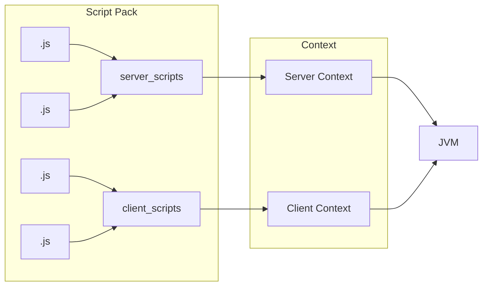

# 编程与脚本环境 {#Environment}

KubeJS 对开发所使用的工具、工作区目录的选择，以及脚本运行环境的区分都有较为明确的要求。这不仅关系到脚本能否被正确识别，也直接影响其可访问的对象、作用范围以及实际执行结果。

若对这些基础规则缺乏了解，往往会出现调用对象不符合预期、逻辑运行结果异常，或在不同环境下行为不一致等问题。因此，在正式开始编写脚本之前，先理解这些内容是十分必要的。

## VSCode {#Vscode}

想要编写 KubeJS 脚本，你需要一款能够编辑文本的工具，例如记事本、Notepad++、Atom、Sublime 或 VS Code 等。其中，==推荐使用 VS Code 进行 KubeJS 开发==，以获得更完善的功能支持与开发体验。!!孩子们不要使用记事本写代码了好么。!!

[VSCode](https://code.visualstudio.com/download) 是一款轻量且扩展性极强的 IDE（集成开发环境），在当前的开发环境中被广泛使用。对于 KubeJS 脚本编写而言，VSCode 提供了良好的编辑体验与插件生态，是推荐使用的开发工具。由于ProbeJS模组导出的`Special.Objects`和`Snippets`强依赖Vscode的相关模块，因此不建议在学习KubeJS或使用其开发时选择其他的IDE。

请参考[该教程](https://zhuanlan.zhihu.com/p/698865320)完成基础的下载与安装。对于初次接触 VSCode 的用户，建议了解其基本界面结构与常用操作（如文件管理、插件安装、终端使用等），但无需在前期投入过多精力进行复杂配置。++但建议检索一款自己心仪的主题包，以便于长期开发。++

:::: flat
::: flat
需要注意的是，VSCode 本身只是一个工具，其核心价值在于提供良好的开发环境，而非决定脚本逻辑的实现方式。因此，在初期阶段，应以“能够正常编写与运行脚本”为目标，而非追求过度复杂或个性化的编辑器配置。
:::
::::

::: alert {"type":"warning","title":"须知","variant":"outlined","density":"comfortable","border":"bottom","textColor":"rgb(207, 216, 82)"}
为了加载{中文:Chinese}语言包，请至少先阅读扩展相关内容。
:::

你可以通过[该页面](https://open-vsx.org/extension/MS-CEINTL/vscode-language-pack-zh-hans)，或直接在扩展商店搜索 `Chinese Language Pack` 来安装中文语言包。

安装完成后，按下 `Ctrl + Shift + P` 打开`命令面板`，输入 `display`，并选择 `Configure Display Language`。随后，VSCode 会列出当前已安装的语言，并标识当前使用的语言。选择目标`语言`后，即可完成界面语言的切换。

## 脚本运行环境 {#FileStructure}

为了确保这一部分内容能够顺利进行，请先确保你已经熟悉 VSCode 的基本使用方式，并能够理解诸如“工作区”等基础概念。

KubeJS 相较于其他魔改模组，在开发体验上的一大优势在于其通过 ProbeJS 提供了完善的类型补全支持。这一能力对于理解实例可用的函数、参数结构以及整体调用方式具有关键作用。相关内容将在后续章节中进行更系统的讲解。

需要注意的是，要使类型补全功能正常生效，你需要将实例文件夹作为 VSCode 的工作区根目录进行打开。该目录通常位于 `kubejs` 文件夹的上一层，即包含 `kubejs` 目录的游戏实例根目录。

通常，一个版本实例的文件结构大致如下：

<LiteTree>
#root=color:white;background:#1565c0;padding:2px 6px;border-radius:3px;font-size:12px;
#tag=color:white;background:#2e7d32;padding:1px 4px;border-radius:2px;font-size:12px;
folder=color:#1976d2;font-weight:500;
log=data:image/svg+xml;base64,PHN2ZyB4bWxucz0iaHR0cDovL3d3dy53My5vcmcvMjAwMC9zdmciIHdpZHRoPSIyNCIgaGVpZ2h0PSIyNCIgdmlld0JveD0iMCAwIDI0IDI0Ij48ZyBmaWxsPSJub25lIj48cGF0aCBkPSJtMTIuNTkzIDIzLjI1OGwtLjAxMS4wMDJsLS4wNzEuMDM1bC0uMDIuMDA0bC0uMDE0LS4wMDRsLS4wNzEtLjAzNXEtLjAxNi0uMDA1LS4wMjQuMDA1bC0uMDA0LjAxbC0uMDE3LjQyOGwuMDA1LjAybC4wMS4wMTNsLjEwNC4wNzRsLjAxNS4wMDRsLjAxMi0uMDA0bC4xMDQtLjA3NGwuMDEyLS4wMTZsLjAwNC0uMDE3bC0uMDE3LS40MjdxLS4wMDQtLjAxNi0uMDE3LS4wMThtLjI2NS0uMTEzbC0uMDEzLjAwMmwtLjE4NS4wOTNsLS4wMS4wMWwtLjAwMy4wMTFsLjAxOC40M2wuMDA1LjAxMmwuMDA4LjAwN2wuMjAxLjA5M3EuMDE5LjAwNS4wMjktLjAwOGwuMDA0LS4wMTRsLS4wMzQtLjYxNHEtLjAwNS0uMDE4LS4wMi0uMDIybS0uNzE1LjAwMmEuMDIuMDIgMCAwIDAtLjAyNy4wMDZsLS4wMDYuMDE0bC0uMDM0LjYxNHEuMDAxLjAxOC4wMTcuMDI0bC4wMTUtLjAwMmwuMjAxLS4wOTNsLjAxLS4wMDhsLjAwNC0uMDExbC4wMTctLjQzbC0uMDAzLS4wMTJsLS4wMS0uMDF6Ii8+PHBhdGggZmlsbD0iY3VycmVudENvbG9yIiBkPSJNMTMuNTg2IDJBMiAyIDAgMCAxIDE1IDIuNTg2TDE5LjQxNCA3QTIgMiAwIDAgMSAyMCA4LjQxNFYyMGEyIDIgMCAwIDEtMiAySDZhMiAyIDAgMCAxLTItMlY0YTIgMiAwIDAgMSAyLTJaTTEyIDRINnYxNmgxMlYxMGgtNC41QTEuNSAxLjUgMCAwIDEgMTIgOC41em0tLjAxIDEwYy41NTggMCAxLjAxLjQ1MiAxLjAxIDEuMDF2MS4xMjRBMSAxIDAgMCAxIDEyLjUgMThoLS40OUExLjAxIDEuMDEgMCAwIDEgMTEgMTYuOTlWMTZhMSAxIDAgMSAxIDAtMnptLjAxLTNhMSAxIDAgMSAxIDAgMmExIDEgMCAwIDEgMC0ybTItNi41ODZWOGgzLjU4NnoiLz48L2c+PC9zdmc+
---
{#root}工作区根目录（实例目录）
    [folder].vscode                  // {#tag}编辑器设置与部分类型产物会出现在这里
    [folder]config                   // 模组与实例配置
    [folder]kubejs //!               真正编写脚本与资源的目录
        [folder]assets               // KubeJS 的[资源包](https://zh.minecraft.wiki/w/%E8%B5%84%E6%BA%90%E5%8C%85)目录
        [folder]client_scripts //!   客户端脚本
        [folder]config               // KubeJS 本地配置
        [folder]data                 // KubeJS 的[数据包](https://zh.minecraft.wiki/w/%E6%95%B0%E6%8D%AE%E5%8C%85)目录
        [folder]server_scripts //!   服务端脚本
        [folder]startup_scripts //!  启动 / 注册阶段脚本
    + [folder]logs                   // 包含游戏与 KubeJS 在运行时产生的日志
        [folder]kubejs //!           KubeJS 日志
            [log]client.log           // 客户端日志
            [log]server.log           // 服务端日志
            [log]startup.log          // 游戏加载时所运行脚本的日志
        [log]latest.log               // 游戏日志
    [folder]mods                     // 模组文件
</LiteTree>

在这一结构中，`kubejs` 并不是孤立的脚本目录，而是整个实例结构的一部分。对于脚本编写、类型补全、日志排查与后续调试而言，`mods`、`logs`、`config` 与 `kubejs` 往往需要结合起来理解。

### 非脚本资源 {#NonScriptResources}

除脚本目录外，`kubejs` 还包含与资源包、数据包对应的内容。这些目录在注册内容、引用资源以及补充逻辑数据时同样具有重要作用。

可以将它们概括为：

- `assets`：负责资源表现，例如语言、纹理、模型等。
- `data`：负责逻辑数据，例如标签、进度、战利品表、配方等。

::::tabs key:ab
== 资源包/assets

`assets` 的基本结构如下：

<LiteTree>
folder=color:#1976d2;font-weight:500;
json=color:#666;
json=data:image/svg+xml;base64,PHN2ZyB4bWxucz0iaHR0cDovL3d3dy53My5vcmcvMjAwMC9zdmciIHdpZHRoPSIyNCIgaGVpZ2h0PSIyNCIgdmlld0JveD0iMCAwIDI0IDI0Ij48cGF0aCBmaWxsPSJjdXJyZW50Q29sb3IiIGQ9Ik00Ljc1IDE1SDYuNXEuNDI1IDAgLjcxMy0uMjg4VDcuNSAxNFY5SDZ2NC43NUg1VjEyLjVIMy43NVYxNHEwIC40MjUuMjg4LjcxM1Q0Ljc1IDE1bTQuNDI1IDBoMS41cS40MjUgMCAuNzEzLS4yODh0LjI4Ny0uNzEydi0xLjVxMC0uNDI1LS4yODgtLjcxMnQtLjcxMi0uMjg4aC0xLjI1di0xLjI1aDF2LjVoMS4yNVYxMHEwLS40MjUtLjI4OC0uNzEyVDEwLjY3NiA5aC0xLjVxLS40MjUgMC0uNzEyLjI4OFQ4LjE3NSAxMHYxLjVxMCAuNDI1LjI4OC43MTN0LjcxMi4yODdoMS4yNXYxLjI1aC0xdi0uNWgtMS4yNVYxNHEwIC40MjUuMjg4LjcxM3QuNzEyLjI4N200LjQtMS41di0zaDF2M3ptLS4yNSAxLjVoMS41cS40MjUgMCAuNzEzLS4yODh0LjI4Ny0uNzEydi00cTAtLjQyNS0uMjg3LS43MTJUMTQuODI1IDloLTEuNXEtLjQyNSAwLS43MTIuMjg4dC0uMjg4LjcxMnY0cTAgLjQyNS4yODguNzEzdC43MTIuMjg3bTMuMTc1IDBoMS4yNXYtMi42MjVsMSAyLjYyNUgyMFY5aC0xLjI1djIuNjI1TDE3Ljc1IDlIMTYuNXpNMyAyMHEtLjgyNSAwLTEuNDEyLS41ODdUMSAxOFY2cTAtLjgyNS41ODgtMS40MTJUMyA0aDE4cS44MjUgMCAxLjQxMy41ODhUMjMgNnYxMnEwIC44MjUtLjU4NyAxLjQxM1QyMSAyMHoiLz48L3N2Zz4=
---
{folder}assets
    {folder}namespace
        {folder}lang                // 语言文件
            [json]zh_cn.json
            [json]en_us.json
        {folder}textures            // 纹理资源
            {folder}item
            {folder}block
        {folder}models              // 模型定义
            {folder}item
            {folder}block
</LiteTree>

其中 `namespace` 表示命名空间，可以存在多个，例如原版的命名空间为 `minecraft`。该目录主要用于存放语言（`lang`）、纹理（`textures`）、模型等资源文件。

::: plain
详情参见 https://zh.minecraft.wiki/w/资源包#文件结构
:::

== 数据包/data

`data` 的基本结构如下：

<LiteTree>
folder=color:#1976d2;font-weight:500;
json=color:#666;
json=data:image/svg+xml;base64,PHN2ZyB4bWxucz0iaHR0cDovL3d3dy53My5vcmcvMjAwMC9zdmciIHdpZHRoPSIyNCIgaGVpZ2h0PSIyNCIgdmlld0JveD0iMCAwIDI0IDI0Ij48cGF0aCBmaWxsPSJjdXJyZW50Q29sb3IiIGQ9Ik00Ljc1IDE1SDYuNXEuNDI1IDAgLjcxMy0uMjg4VDcuNSAxNFY5SDZ2NC43NUg1VjEyLjVIMy43NVYxNHEwIC40MjUuMjg4LjcxM1Q0Ljc1IDE1bTQuNDI1IDBoMS41cS40MjUgMCAuNzEzLS4yODh0LjI4Ny0uNzEydi0xLjVxMC0uNDI1LS4yODgtLjcxMnQtLjcxMi0uMjg4aC0xLjI1di0xLjI1aDF2LjVoMS4yNVYxMHEwLS40MjUtLjI4OC0uNzEyVDEwLjY3NiA5aC0xLjVxLS40MjUgMC0uNzEyLjI4OFQ4LjE3NSAxMHYxLjVxMCAuNDI1LjI4OC43MTN0LjcxMi4yODdoMS4yNXYxLjI1aC0xdi0uNWgtMS4yNVYxNHEwIC40MjUuMjg4LjcxM3QuNzEyLjI4N200LjQtMS41di0zaDF2M3ptLS4yNSAxLjVoMS41cS40MjUgMCAuNzEzLS4yODh0LjI4Ny0uNzEydi00cTAtLjQyNS0uMjg3LS43MTJUMTQuODI1IDloLTEuNXEtLjQyNSAwLS43MTIuMjg4dC0uMjg4LjcxMnY0cTAgLjQyNS4yODguNzEzdC43MTIuMjg3bTMuMTc1IDBoMS4yNXYtMi42MjVsMSAyLjYyNUgyMFY5aC0xLjI1djIuNjI1TDE3Ljc1IDlIMTYuNXpNMyAyMHEtLjgyNSAwLTEuNDEyLS41ODdUMSAxOFY2cTAtLjgyNS41ODgtMS40MTJUMyA0aDE4cS44MjUgMCAxLjQxMy41ODhUMjMgNnYxMnEwIC44MjUtLjU4NyAxLjQxM1QyMSAyMHoiLz48L3N2Zz4=
---
{folder}data
    {folder}namespace
        {folder}tags                // 标签
            {folder}items
            {folder}blocks
        {folder}recipes             // 配方
            [json]example_recipe.json
        {folder}loot_tables         // 战利品表
            {folder}blocks
            {folder}entities
        {folder}advancements        // 进度
            [json]example_advancement.json
</LiteTree>

其中 `namespace` 同样表示命名空间，可以存在多个，例如原版的命名空间为 `minecraft`。该目录主要用于存放标签（`tags`）、进度（`advancements`）、战利品表（`loot_tables`）、配方等数据文件。

::: plain
详情参见 https://zh.minecraft.wiki/w/数据包#文件夹结构
:::
::::

:::: alert {"type":"warning","title":"请注意！","variant":"tonal"}
资源文件与数据文件都遵循“命名空间 + 路径”的组织方式；当不同来源提供了相同路径的内容时，最终生效结果将由优先级决定。
::::

在资源包与数据包系统中，优先级可以理解为生效顺序：优先级较低的内容先加载，优先级较高的内容后加载，并能够覆盖前者。通常情况下，不建议在没有明确目的的前提下直接覆盖已有资源或数据；若确有需求，则应在实现后结合优先级关系检查最终结果是否符合预期。

### 脚本资源 {#ScriptResources}

与 `assets` 和 `data` 不同，脚本资源用于编写并执行实际逻辑，是 KubeJS 的核心部分。按照职责与执行阶段，通常可作如下区分：

| 目录 | 主要职责 | 常见重载方式 |
| :--- | :--- | :--- |
| `startup_scripts` | 启动阶段的注册与初始化 | 重启游戏，或 `/kubejs reload startup_scripts` |
| `server_scripts` | 逻辑服务端上的事件、配方、规则与世界逻辑 | 进入世界或 `/reload` |
| `client_scripts` | 逻辑客户端上的界面、提示、渲染与本地表现 | `F3 + T` 或 `/kubejs reload client_scripts` (需确保在资源文件更新时使用`F3 + T`来刷新资源文件加载) |

这种划分并不仅是功能分类，而是直接对应不同的运行上下文。若忽略这一点，后续往往会出现“逻辑已经执行，但结果与预期不一致”的现象。

#### 运行环境 {#Platform}

理解 KubeJS 的脚本目录之前，有必要先区分 Minecraft / Forge 中同时存在的两组概念：

| 维度 | 客户端 | 服务端 |
| :--- | :--- | :--- |
| 物理层 | 带有渲染、音频与输入的客户端进程 | 不包含客户端界面的专用服务端进程 |
| 逻辑层 | 负责本地表现、输入与界面的上下文 | 负责权威世界状态与规则判定的上下文 |

其中最容易引起误解的，==是单人世界并不等于“只有客户端”==。单人世界与局域网主机本质上是在一个客户端进程中，同时运行逻辑客户端与逻辑服务端；而专用服务端则仅包含逻辑服务端，不存在客户端上下文。

:::: alert {"type":"info","title":"应当明确的结论","variant":"outlined","border":"start"}
`server_scripts` 所对应的是逻辑服务端，而不是“远程另一台机器上的代码”。因此，在单人世界中，`server_scripts` 同样会运行。
::::

从脚本目录与运行上下文的关系来看，可以将其概括为下图：



该图所表达的含义是：脚本首先依据目录被分配到不同的上下文，随后再由实际运行环境承载。因此，目录名称与“是否位于远程服务器”并不是同一层概念。

#### 本地世界与专用服务端 {#SingleplayerVsDedicated}

在不同游戏场景下，脚本目录与实际运行环境之间的对应关系可以整理如下：

| 场景 | 实际存在的运行结构 | 对脚本的直接影响 |
| :--- | :--- | :--- |
| 单人世界 / 局域网主机 | 一个物理客户端进程，内部同时存在逻辑客户端与逻辑服务端 | `server_scripts` 与 `client_scripts` 都可能生效 |
| 专用服务端 | 只有物理服务端进程，且仅有逻辑服务端 | `server_scripts` 可以运行，`client_scripts` 不存在 |
| 连接专服的普通玩家客户端 | 一个物理客户端进程，仅包含本地逻辑客户端 | 本地 `client_scripts` 会运行，但不具备世界状态权威 |

而使用更简单的语言解释则是：

- `server_scripts` 在单人世界中并不会消失，它仍然承担主要的整合包逻辑。
- `client_scripts` 只能依附于客户端环境存在。
- `startup_scripts` 更接近加载阶段脚本，不能简单理解为只在某一侧运行。

这些差异并非 KubeJS 独有，而是源于 Minecraft 与 Forge 本身的客户端-服务端侧别设计。

#### 本地可见，不代表服务端安全 {#WhyItBreaksOnDedicated}

在单人世界中，逻辑服务端寄宿于客户端进程内部。因此，某些不严谨的写法在本地测试时未必立即暴露问题；但一旦移至专用服务端，原本依赖客户端环境的类或对象将不存在，错误就会直接显现。

:::: alert {"type":"error","title":"务必注意","variant":"tonal"}
如果某段脚本涉及 `net.minecraft.client.*`、渲染、界面、按键、JEI / REI / EMI 的客户端展示层内容，就不应默认其能够安全运行在 `server_scripts` 或专用服务端环境中。
::::

因此，所谓“某些 Client 相关内容在本地似乎也能从 `server_scripts` 接触到”，并不意味着 `server_scripts` 具备客户端语义；它只说明单人世界的逻辑服务端与客户端进程位于同一物理环境中。

#### 行为已取消，但表现仍然存在 {#PredictionMismatch}

考虑下面这一段常见脚本：

```js
ItemEvents.rightClicked(event => {
  if (event.item.id === 'minecraft:ender_pearl') {
    event.cancel()
  }
})
```

若该逻辑仅编写在 `server_scripts` 中，它会在逻辑服务端上完成取消判定；但客户端仍可能已经先执行了本地挥手、动画、提示，或其他预测性表现。于是最终现象就会表现为：

- 服务端已经否决了该行为。
- 客户端仍然短暂展示出部分本地反馈。

这并不表示事件没有生效，而是说明客户端与服务端分别承担不同职责。若需要同时控制“逻辑结果”与“本地表现”，就应根据事件本身的特性，分别在两侧进行处理，或通过同步机制将服务端结果显式反馈至客户端。

::::tabs key:ba
== server_scripts
```js
ItemEvents.rightClicked(event => {
  if (event.item.id === 'minecraft:ender_pearl') {
    event.cancel()
  }
})
```

== client_scripts
```js
ItemEvents.rightClicked(event => {
  if (event.item.id === 'minecraft:ender_pearl') {
    event.cancel()
  }
})
```
::::

并不是所有逻辑都需要在两个目录中各写一份，但应当明确：服务端负责权威判定，客户端负责本地表现；若只处理其中一侧，另一侧仍可能保留残余行为。

#### 如何判断当前环境 {#CheckSide}

在脚本编写过程中，环境判断通常可从两个层面进行：

- 当关注“当前事件或当前世界属于逻辑客户端还是逻辑服务端”时，应优先使用 `level.isClientSide()`，或从上下文对象获得 `entity.level().isClientSide()` 之类的判断。
- 当关注“当前运行环境是否具备客户端发行版，可以安全接触客户端专属类”时，才应考虑 `Platform.isClientEnvironment()` 这类更偏启动环境的判断。

例如，在启动阶段脚本中，若某段逻辑明确依赖客户端专属类，则应显式进行隔离：

```js
StartupEvents.init(event => {
  if (!Platform.isClientEnvironment()) return

  // client-only bootstrap
})
```

而在普通事件回调中，如果只是为了判断当前 `Level` 所处的逻辑侧，那么更适合直接使用 `level.isClientSide()`，而不是将这类判断全部交给 `Platform`。

#### 关于 startup_scripts {#StartupReminder}

KubeJS 官方事件页明确将 `startup_scripts` 归类为启动期事件，并指出其在启动阶段面向客户端与服务端运行。因此，这一目录更适合承担下列职责：

- 注册物品、方块、流体及配方类型。
- 执行启动阶段初始化。
- 放置必须在游戏启动阶段完成的监听或接线逻辑。

相对地，下列内容通常不适合放入 `startup_scripts`：

- 依赖玩家、实体、世界实时状态的运行时逻辑。
- 默认假设自己只会在客户端或只会在服务端执行的代码。
- 未经隔离便直接引用客户端专属类的实现。

综上，理解 `kubejs` 的三个脚本目录，关键不在于记住文件夹名称本身，而在于理解它们分别映射到怎样的运行上下文，以及这些上下文在单人世界与专用服务端中的具体差异。

关于更具体的事件结构、类型补全与后续实践，将在 [ProbeJS](./ProbeJS)、[你的第一个脚本](./YourFirstScript) 与 [调试](./Debugging) 等章节中继续展开。

*[IDE]: Integrated Development Environment，集成开发环境。
