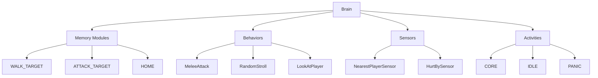
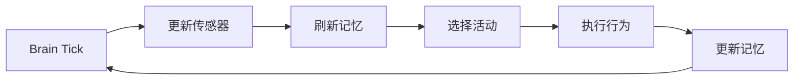

# Brain 系统指南

## 概述 {#overview}

Brain 系统是 Minecraft 1.16+ 的现代化 AI 架构，采用记忆驱动的行为管理。相比 Goal 系统，Brain 提供更智能的决策和状态管理能力。

### 核心组件



## Brain 执行流程 {#mechanism}



## 主要组件与支持表 {#components}

| 组件类型         | 关键成员/方法                | 说明              | KubeJS 支持 | EntityJS 支持 |
| ---------------- | ---------------------------- | ----------------- | ----------- | ------------- |
| 记忆模块         | WALK_TARGET, HOME 等         | 实体的短/长期记忆 | 部分        | 全部          |
| 行为（Behavior） | meleeAttack, randomStroll 等 | 行为逻辑单元      | 仅 Goal     | 全部          |
| 活动（Activity） | CORE, IDLE, PANIC 等         | 行为分组与切换    | 仅 Goal     | 全部          |
| 传感器（Sensor） | nearest_player, hurt_by 等   | 感知环境与实体    | 否          | 全部          |

---

## KubeJS 原生操作 {#kubejs_native}

::: code-group

```js [KubeJS]
const brain = mob.getBrain();
const $MemoryModuleType = Java.loadClass(
    "net.minecraft.world.entity.ai.memory.MemoryModuleType"
);
// 读取/设置/清除记忆
brain.setMemory($MemoryModuleType.ATTACK_TARGET, targetEntity);
brain.eraseMemory($MemoryModuleType.WALK_TARGET);
if (brain.hasMemoryValue($MemoryModuleType.HOME)) {
    /* ... */
}
```

```js [EntityJS]
EntityJSEvents.buildBrain("minecraft:villager", (event) => {
    event.coreActivity(1, [event.behaviors.meleeAttack(5)]);
    event.idleActivity(1, [event.behaviors.randomStroll(8, 1.0)]);
});
```

:::

-   复杂记忆如 WalkTarget 推荐用 EntityJS 设置。
-   传感器、活动注册仅 EntityJS 支持。

---

## 行为/记忆/传感器表 {#tables}

| 类型   | 名称            | 说明         | KubeJS  | EntityJS |
| ------ | --------------- | ------------ | ------- | -------- |
| 记忆   | WALK_TARGET     | 移动目标     | 部分    | 支持     |
| 记忆   | ATTACK_TARGET   | 攻击目标     | 支持    | 支持     |
| 记忆   | HOME            | 家/归属地    | 支持    | 支持     |
| 记忆   | ANGRY_AT        | 愤怒对象     | 支持    | 支持     |
| 行为   | meleeAttack     | 近战攻击     | 仅 Goal | 支持     |
| 行为   | randomStroll    | 随机游走     | 仅 Goal | 支持     |
| 行为   | lookAtPlayer    | 注视玩家     | 仅 Goal | 支持     |
| 行为   | animalPanic     | 恐慌逃跑     | 仅 Goal | 支持     |
| 活动   | CORE/IDLE/PANIC | 行为分组     | 仅 Goal | 支持     |
| 传感器 | nearest_player  | 感知最近玩家 | 否      | 支持     |
| 传感器 | hurt_by         | 感知受伤     | 否      | 支持     |

---

## 限制与解决方案 {#limitations}

::: code-group

```js [反例]
// KubeJS 直接构造 WalkTarget 可能报错
const $WalkTarget = Java.loadClass(
    "net.minecraft.world.entity.ai.memory.WalkTarget"
);
const walkTarget = new $WalkTarget(blockPos, 1.0, 5); // 可能失败
```

```js [推荐]
// 推荐用 EntityJS buildBrain 设置移动目标
EntityJSEvents.buildBrain("minecraft:villager", (event) => {
    event.idleActivity(1, [event.behaviors.randomStroll(8, 1.0)]);
});
```

:::

-   复杂记忆、行为建议用 EntityJS。
-   KubeJS 仅适合简单记忆赋值。

---

## 调试与性能优化 {#tips}

::: code-group

```js [调试推荐]
function debugBrain(entity) {
    const brain = entity.getBrain();
    const $MemoryModuleType = Java.loadClass(
        "net.minecraft.world.entity.ai.memory.MemoryModuleType"
    );
    ["WALK_TARGET", "ATTACK_TARGET", "HOME"].forEach((type) => {
        if (brain.hasMemoryValue($MemoryModuleType[type])) {
            console.log(`${type}: ${brain.getMemory($MemoryModuleType[type])}`);
        }
    });
}
```
:::

---

## EntityJS Brain/Behavior/Goal 系统详解 {#entityjs_brain_goal}

### 概述与架构 {#overview_brain_goal}

Brain/Goal 系统是 Minecraft 现代 AI 的核心，EntityJS 提供了极为丰富的行为工厂、活动注册、记忆/传感器管理能力，适合复杂 NPC、智能生物等场景。

---

### EntityJS Behaviors 工厂方法参数表 {#behaviors_factory_table}

| 方法名          | 适用实体   | 参数                  | 参数类型                       | 说明             |
| --------------- | ---------- | --------------------- | ------------------------------ | ---------------- |
| acquirePoi      | pathfinder | poiType               | Predicate\<Holder\<PoiType>>   | 兴趣点筛选       |
|                 |            | memoryKey             | MemoryModuleType\<GlobalPos>   | 需缺失的记忆类型 |
|                 |            | memoryToAcquire       | MemoryModuleType\<GlobalPos>   | 获取后写入的记忆 |
|                 |            | onlyIfAdult           | boolean                        | 仅限成年体       |
|                 |            | onPoiAcquisitionEvent | Byte/Null                      | 事件 ID，可空    |
| animalMakeLove  | animal     | partnerType           | EntityType                     | 可繁殖对象类型   |
|                 |            | speedModifier         | float                          | 行为激活时速度   |
| animalPanic     | pathfinder | speedModifier         | float                          | 恐慌时速度       |
| babyFollowAdult | ageable    | minFollowRange        | int                            | 最小跟随距离     |
|                 |            | maxFollowRange        | int                            | 最大跟随距离     |
|                 |            | speedModifier         | Function\<LivingEntity, Float> | 跟随速度         |
| ...             | ...        | ...                   | ...                            | ...              |

> **建议：文档中完整列出所有 Behaviors 方法及参数，详见源码。**

---

### buildBrainProvider/buildBrain/addActivity/coreActivity/idleActivity 参数表 {#brain_provider_params}

| 方法名       | 参数      | 类型             | 说明             |
| ------------ | --------- | ---------------- | ---------------- |
| addMemory    | memory    | MemoryModuleType | 注册记忆模块     |
| addSensor    | sensor    | SensorType       | 注册传感器       |
| coreActivity | priority  | int              | 优先级，越小越高 |
|              | behaviors | List\<Behavior>  | 行为列表         |
| idleActivity | priority  | int              | 优先级           |
|              | behaviors | List\<Behavior>  | 行为列表         |
| addActivity  | activity  | Activity/字符串  | 活动类型         |
|              | priority  | int              | 优先级           |
|              | behaviors | List\<Behavior>  | 行为列表         |

---

### Activity/行为注册机制说明 {#activity_mechanism}

-   `coreActivity`：实体始终活跃的基础行为（如呼吸、基础移动）。
-   `idleActivity`：实体空闲时的行为（如游走、观察）。
-   `addActivity`：可注册任意自定义活动（如"工作"、"战斗"、"恐慌"等），并指定优先级和行为集。
-   活动切换由 Brain 系统根据记忆、传感器等自动管理。

---

### Goal/GoalSelector/GoalEventJS 类型说明 {#goal_types}

-   **GoalSelector**：行为目标选择器（goalSelector）/攻击目标选择器（targetSelector）。
-   **GoalEventJS**：暴露 isPathFinder、isAnimal、isTamable、isRangedAttack、isHorse、isNeutral 等属性，便于类型判断。
-   **getEntity()**：返回当前 Mob 实例。

---

### code-group 实用示例 {#code_examples}

::: code-group

```js [EntityJS]
EntityJSEvents.buildBrainProvider("minecraft:villager", (event) => {
    event.addMemory(MemoryModuleType.HOME);
    event.addSensor(SensorType.NEAREST_PLAYER);
});
EntityJSEvents.buildBrain("minecraft:villager", (event) => {
    event.coreActivity(1, [
        event.behaviors.meleeAttack(5),
        event.behaviors.lookAtPlayer(6, 8),
    ]);
    event.idleActivity(2, [event.behaviors.randomStroll(8, 1.0)]);
    event.addActivity(Activity.WORK, 3, [
        event.behaviors.animalMakeLove(EntityType.VILLAGER, 0.2),
    ]);
});
```

:::

---

### 常见易错点/性能建议/最佳实践 {#best_practices}

-   **行为/活动优先级**：数值越小优先级越高，避免冲突。
-   **行为参数类型**：如 speedModifier 可为 float 或 Function，注意类型一致。
-   **性能陷阱**：行为 tick 内避免全局遍历实体，推荐缓存/降频。
-   **Goal/Brain 混用**：Goal 适合简单 AI，Brain 适合复杂决策。
-   **EntityJS 行为工厂方法**：仅能用于 buildBrain 事件，不能直接用于 goalSelector。

---

### Markdown 锚点唯一性说明 {#anchor_uniqueness}

-   保证每个 `{#xxx}` 只出现一次，且全局唯一。
-   推荐用 `{#custom_goal_xxx}` 这种带后缀的唯一 id。
-   检查所有 `## ... {#...}`，确保 id 唯一，避免 copy-paste 时重复。

---

> 如需完整 Behaviors 方法参数表、全部事件参数表、详细 code-group 示例等，请指定需要哪一部分，可直接为你生成 markdown 片段，确保文档极致详尽且无锚点冲突！
