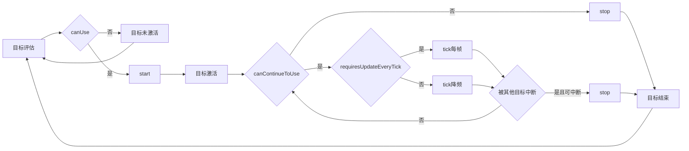

# 实体目标（Goal）系统 {#KubeJsGoalSystem}

## 基础说明 {#KubeJsOverview}

AI 目标（Goal）系统是 Minecraft 实体 AI 的核心，定义了实体的行为优先级与决策逻辑。每个生物的行为都由一系列目标组成，这些目标按优先级执行，形成复杂而自然的行为模式。

KubeJS 通过 Java 反射机制提供了对实体 AI 目标的完整控制能力，让你可以创建完全自定义的实体行为。

### 架构

```
Entity
└── Mob
    ├── goalSelector（行为目标选择器）
    └── targetSelector（攻击目标选择器）
```

**两种目标选择器的区别：**

- **`goalSelector`**：控制实体的日常行为，如移动、观察、浮水、巡逻等基础行为
- **`targetSelector`**：专门处理敌对行为，如选择攻击目标、反击、追踪敌人等

## 目标执行机制 {#mechanism}

### 目标生命周期

每个 Goal 都遵循以下执行流程：



**生命周期详解：**

1. **评估阶段**：系统调用 `canUse()` 检查目标是否应该激活
2. **启动阶段**：如果可以使用，调用 `start()` 初始化目标状态
3. **执行阶段**：持续调用 `tick()` 执行目标逻辑，同时检查 `canContinueToUse()`
4. **中断检测**：检查是否被更高优先级的目标中断（基于 `isInterruptable()`）
5. **结束阶段**：调用 `stop()` 清理目标状态，然后重新进入评估循环

### 优先级与冲突管理

- **优先级规则**：数值越小，优先级越高（0 为最高优先级）
- **并行执行**：不冲突的目标可以同时运行
- **冲突解决**：通过 Goal.Flag 系统判断目标间是否冲突
- **中断机制**：高优先级目标可以中断正在执行的低优先级目标

## 常用类型与用法 {#KubeJsGoalTypes}

### 基础行为目标 {#behavior}

| 目标类 | 功能描述 | 构造参数 | 使用场景 |
|--------|----------|----------|----------|
| `FloatGoal` | 在水中保持浮起状态 | `(mob)` | 几乎所有陆地生物的必备目标 |
| `RandomStrollGoal` | 在附近区域随机游走 | `(mob, speed)` | 让生物看起来更有活力 |
| `LookAtPlayerGoal` | 注视玩家 | `(mob, targetType, range)` | 增加生物的互动感 |
| `RandomLookAroundGoal` | 随机四处张望 | `(mob)` | 让生物显得更自然 |
| `PanicGoal` | 受伤后惊慌逃跑 | `(mob, speed)` | 被动生物的标准反应 |

### 攻击与目标选择 {#attack}

| 目标类 | 功能描述 | 构造参数 | 使用场景 |
|--------|----------|----------|----------|
| `MeleeAttackGoal` | 近战攻击行为 | `(mob, speed, followTarget)` | 近战敌对生物必备 |
| `RangedAttackGoal` | 远程攻击行为 | `(mob, speed, attackRadius, attackInterval)` | 弓箭手、法师类生物 |
| `HurtByTargetGoal` | 反击攻击者 | `(mob, ...allies)` | 大多数生物的自卫机制 |
| `NearestAttackableTargetGoal` | 主动攻击最近敌人 | `(mob, targetClass, mustSee)` | 敌对生物的核心目标 |

### 特殊行为目标 {#special}

| 目标类 | 功能描述 | 构造参数 | 使用场景 |
|--------|----------|----------|----------|
| `AvoidEntityGoal` | 避开特定实体 | `(mob, entityType, distance, walkSpeed, sprintSpeed)` | 让生物害怕某些威胁 |
| `FollowOwnerGoal` | 跟随主人 | `(mob, speed, minDistance, maxDistance)` | 驯服生物的忠诚行为 |
| `SitWhenOrderedToGoal` | 听从坐下指令 | `(mob)` | 可驯服生物的服从性 |
| `BreedGoal` | 繁殖行为 | `(mob, speed)` | 让生物能够繁殖后代 |

## 用法与实践 {#KubeJsBestPractice}

### 创建自定义僵尸

```js
EntityEvents.spawned(event => {
    const entity = event.entity;
    if (entity.type === "minecraft:zombie") {
        // 加载所需的目标类
        const FloatGoal = Java.loadClass("net.minecraft.world.entity.ai.goal.FloatGoal");
        const MeleeAttackGoal = Java.loadClass("net.minecraft.world.entity.ai.goal.MeleeAttackGoal");
        const RandomStrollGoal = Java.loadClass("net.minecraft.world.entity.ai.goal.RandomStrollGoal");
        const LookAtPlayerGoal = Java.loadClass("net.minecraft.world.entity.ai.goal.LookAtPlayerGoal");
        const HurtByTargetGoal = Java.loadClass("net.minecraft.world.entity.ai.goal.target.HurtByTargetGoal");
        const NearestAttackableTargetGoal = Java.loadClass("net.minecraft.world.entity.ai.goal.target.NearestAttackableTargetGoal");
        const PlayerClass = Java.loadClass("net.minecraft.world.entity.player.Player");

        // 清空现有的所有目标
        entity.goalSelector.removeAllGoals(goal => true);
        entity.targetSelector.removeAllGoals(goal => true);

        // 重新设置目标系统
        // 行为目标
        entity.goalSelector.addGoal(0, new FloatGoal(entity));                        // 浮水
        entity.goalSelector.addGoal(3, new MeleeAttackGoal(entity, 1.0, true));       // 近战攻击
        entity.goalSelector.addGoal(7, new RandomStrollGoal(entity, 1.0));            // 随机游走
        entity.goalSelector.addGoal(8, new LookAtPlayerGoal(entity, PlayerClass, 8.0)); // 注视玩家
        
        // 攻击目标
        entity.targetSelector.addGoal(1, new HurtByTargetGoal(entity));               // 反击
        entity.targetSelector.addGoal(2, new NearestAttackableTargetGoal(entity, PlayerClass, true)); // 主动攻击玩家
        
        entity.customName = "定制僵尸";
    }
});
```

### 创建无害生物 {#PeacefulMobSample}

```js
ItemEvents.entityInteracted(event => {
    const { target: entity, player, hand } = event;
    if (hand !== "MAIN_HAND") return;
    
    if (entity.type === "minecraft:zombie") {
        const NearestAttackableTargetGoal = Java.loadClass("net.minecraft.world.entity.ai.goal.target.NearestAttackableTargetGoal");
        const HurtByTargetGoal = Java.loadClass("net.minecraft.world.entity.ai.goal.target.HurtByTargetGoal");
        
        // 移除所有攻击性目标
        entity.targetSelector.removeAllGoals(goal => 
            goal instanceof NearestAttackableTargetGoal || 
            goal instanceof HurtByTargetGoal
        );
        
        // 清除当前攻击目标
        entity.setTarget(null);
        
        player.tell("这只僵尸现在是友好的了！");
    }
});
```

### 类型安全检查

```js
// 推荐：使用类型检查而非 try-catch
const $PathfinderMob = Java.loadClass("net.minecraft.world.entity.PathfinderMob");
const $Mob = Java.loadClass("net.minecraft.world.entity.Mob");

if (entity instanceof $PathfinderMob) {
    // 只有 PathfinderMob 才能使用复杂的导航目标
    const complexGoal = new SomeNavigationGoal(entity);
    entity.goalSelector.addGoal(priority, complexGoal);
} else if (entity instanceof $Mob) {
    // 基础 Mob 使用简单目标
    const simpleGoal = new SimpleGoal(entity);
    entity.goalSelector.addGoal(priority, simpleGoal);
}
```

### 目标优先级规划

建议的优先级分配：

```js
// 0-2: 生存必需（浮水、逃跑、反击）
entity.goalSelector.addGoal(0, new FloatGoal(entity));
entity.goalSelector.addGoal(1, new PanicGoal(entity, 2.0));
entity.targetSelector.addGoal(1, new HurtByTargetGoal(entity));

// 3-5: 主要行为（攻击、繁殖、跟随）
entity.goalSelector.addGoal(3, new MeleeAttackGoal(entity, 1.0, true));
entity.goalSelector.addGoal(4, new BreedGoal(entity, 1.0));
entity.targetSelector.addGoal(2, new NearestAttackableTargetGoal(entity, PlayerClass, true));

// 6-8: 社交行为（注视、交互）
entity.goalSelector.addGoal(6, new LookAtPlayerGoal(entity, PlayerClass, 8.0));

// 9+: 闲置行为（游走、四处张望）
entity.goalSelector.addGoal(9, new RandomStrollGoal(entity, 1.0));
entity.goalSelector.addGoal(10, new RandomLookAroundGoal(entity));
```

### 性能优化

```js
// 避免过于频繁的检查
EntityJSEvents.addGoalSelectors('minecraft:villager', e => {
    e.customGoal(
        'optimizedBehavior',
        5,
        mob => {
            // 使用随机数降低检查频率
            return mob.getRandom().nextInt(100) < 5;
        },
        mob => true,
        false, // 不要求每帧更新
        mob => {},
        mob => {},
        true,
        mob => {
            // 缓存昂贵的计算
            const data = mob.getPersistentData();
            const lastUpdate = data.getLong("lastExpensiveUpdate");
            const currentTime = mob.level.getGameTime();
            
            if (currentTime - lastUpdate > 20) { // 每秒更新一次
                // 执行昂贵的计算
                const nearbyEntities = mob.level.getNearbyEntities(mob.blockPosition(), 16);
                data.putInt("nearbyEntityCount", nearbyEntities.length);
                data.putLong("lastExpensiveUpdate", currentTime);
            }
        }
    );
});
```

### 调试技巧

```js
// 添加调试信息
function debugEntityGoals(entity) {
    console.log("=== Goal Selector ===");
    entity.goalSelector.getAvailableGoals().forEach(goalWrapper => {
        const goal = goalWrapper.getGoal();
        const priority = goalWrapper.getPriority();
        const isRunning = goalWrapper.isRunning();
        console.log(`Priority ${priority}: ${goal} (${isRunning ? "运行中" : "未激活"})`);
    });
    
    console.log("=== Target Selector ===");
    entity.targetSelector.getAvailableGoals().forEach(goalWrapper => {
        const goal = goalWrapper.getGoal();
        const priority = goalWrapper.getPriority();
        const isRunning = goalWrapper.isRunning();
        console.log(`Priority ${priority}: ${goal} (${isRunning ? "运行中" : "未激活"})`);
    });
}

// 在游戏中使用调试命令
ItemEvents.entityInteracted(event => {
    const { target: entity, player, hand } = event;
    if (hand === "MAIN_HAND" && player.getMainHandItem().id === "minecraft:stick") {
        debugEntityGoals(entity);
    }
});
```

### 实用工具函数

```js
// 实体行为管理工具
const EntityBehaviorUtils = {
    // 安全地添加目标（检查是否已存在）
    safeAddGoal(entity, selector, priority, goal) {
        const existingGoals = selector.getAvailableGoals();
        const hasGoal = existingGoals.some(wrapper => 
            wrapper.getGoal().getClass() === goal.getClass()
        );
        
        if (!hasGoal) {
            selector.addGoal(priority, goal);
            return true;
        }
        return false;
    },
    
    // 切换实体的敌对状态
    toggleHostility(entity, isHostile) {
        const NearestAttackableTargetGoal = Java.loadClass("net.minecraft.world.entity.ai.goal.target.NearestAttackableTargetGoal");
        const PlayerClass = Java.loadClass("net.minecraft.world.entity.player.Player");
        
        if (isHostile) {
            this.safeAddGoal(entity, entity.targetSelector, 2, 
                new NearestAttackableTargetGoal(entity, PlayerClass, true));
        } else {
            entity.targetSelector.removeAllGoals(goal => goal instanceof NearestAttackableTargetGoal);
            entity.setTarget(null);
        }
    },
    
    // 获取实体当前活跃的目标数量
    getActiveGoalCount(entity) {
        const goalCount = entity.goalSelector.getAvailableGoals()
            .filter(wrapper => wrapper.isRunning()).length;
        const targetCount = entity.targetSelector.getAvailableGoals()
            .filter(wrapper => wrapper.isRunning()).length;
        
        return { goals: goalCount, targets: targetCount };
    }
};

// 使用示例
ItemEvents.entityInteracted(event => {
    const { target: entity, player, hand } = event;
    if (hand === "MAIN_HAND" && player.isShiftKeyDown()) {
        const counts = EntityBehaviorUtils.getActiveGoalCount(entity);
        player.tell(`活跃目标: ${counts.goals} 个行为, ${counts.targets} 个攻击目标`);
        
        // 切换敌对状态
        const isCurrentlyHostile = entity.getTarget() != null;
        EntityBehaviorUtils.toggleHostility(entity, !isCurrentlyHostile);
        player.tell(`实体现在${!isCurrentlyHostile ? "敌对" : "友好"}`);
    }
});
```

## EntityJS {#EntityJsExtension}

::: alert {"type": "warning", "title": "EntityJS 专用"}
以下内容仅适用于 EntityJS 附属，KubeJS 原生不支持。
:::

### 事件 {#EntityJsRegister}

- `addGoalSelectors`：注册行为目标
- `addGoals`：注册攻击目标
- `removeGoal`/`removeGoals`：移除目标
- 支持所有原生目标类，也支持自定义 Goal

### customGoal 参数 {#EntityJsCustomGoalParams}

| 参数名 | 类型 | 说明 |
|--------|------|------|
| goalName | string | 目标名称，必须全局唯一，建议用英文+功能描述，如 'customGoalPatrol' |
| priority | int | 优先级，越小越高 |
| canUse | (mob) => boolean | 激活条件 |
| canContinueToUse | (mob) => boolean | 继续条件 |
| requiresUpdateEveryTick | boolean | 是否每帧更新 |
| start | (mob) => void | 开始执行时调用 |
| stop | (mob) => void | 结束执行时调用 |
| isInterruptable | boolean | 是否可被中断 |
| tick | (mob) => void | 每帧逻辑 |

### 命名规范 {#EntityJsCustomGoalNaming}

- 每个 customGoal 的 goalName 必须唯一，不能重复。
- 推荐命名格式：`customGoal功能`，如 `customGoalPatrol`、`customGoalPack`、`customGoalBuild`。
- Markdown 段落锚点也应唯一，如 {#EntityJsCustomGoalPatrol}。

### 高级示例 {#EntityJsCustomGoalExamples}

#### 智能巡逻 {#EntityJsCustomGoalPatrol}

```js
EntityJSEvents.addGoalSelectors('minecraft:iron_golem', e => {
    e.customGoal(
        'customGoalPatrol',
        3,
        mob => {
            // 只在白天且村庄中心附近巡逻
            const world = mob.level;
            const isDaytime = world.isDay();
            const nearVillage = world.getNearbyEntities(mob.blockPosition(), 32)
                .some(entity => entity.type === "minecraft:villager");
            
            return isDaytime && nearVillage && mob.getRandom().nextInt(200) < 5;
        },
        mob => {
            // 继续巡逻直到到达目标或夜晚降临
            return !mob.getNavigation().isDone() && mob.level.isDay();
        },
        false,
        mob => {
            // 开始巡逻：选择村庄边缘的巡逻点
            const world = mob.level;
            const currentPos = mob.blockPosition();
            
            // 寻找最远的村民作为参考点
            const villagers = world.getNearbyEntities(currentPos, 32)
                .filter(e => e.type === "minecraft:villager");
            
            if (villagers.length > 0) {
                const farthestVillager = villagers.reduce((prev, current) => 
                    mob.distanceTo(current) > mob.distanceTo(prev) ? current : prev
                );
                
                const targetPos = farthestVillager.blockPosition().offset(
                    (mob.getRandom().nextInt(10) - 5),
                    0,
                    (mob.getRandom().nextInt(10) - 5)
                );
                
                mob.getNavigation().moveTo(targetPos.x, targetPos.y, targetPos.z, 0.8);
                console.log(`${mob.getName()} 开始巡逻村庄边界`);
            }
        },
        mob => {
            mob.getNavigation().stop();
            console.log(`${mob.getName()} 巡逻结束`);
        },
        true,
        mob => {
            // 巡逻中检测威胁
            const nearbyHostiles = mob.level.getNearbyEntities(mob.blockPosition(), 16)
                .filter(e => e.getMobCategory().toString() === "MONSTER");
            
            if (nearbyHostiles.length > 0) {
                const threat = nearbyHostiles[0];
                mob.getNavigation().moveTo(threat.getX(), threat.getY(), threat.getZ(), 1.5);
                mob.setTarget(threat);
                mob.level.playSound(null, mob.blockPosition(), 
                    "minecraft:entity.iron_golem.attack", "neutral", 1.0, 0.8);
            }
        }
    );
});
```

#### 群体协作 {#EntityJsCustomGoalPack}

```js
EntityJSEvents.addGoalSelectors('minecraft:wolf', e => {
    e.customGoal(
        'customGoalPack',
        2,
        mob => {
            if (!mob.isTame() || mob.getTarget() == null) return false;
            const packMates = mob.level.getEntitiesWithin(mob.boundingBox.inflate(20))
                .filter(e => e.type === "minecraft:wolf" && e !== mob && e.isTame());
            return packMates.length >= 1;
        },
        mob => mob.getTarget() != null && mob.getTarget().isAlive(),
        false,
        mob => {
            const target = mob.getTarget();
            const packMates = mob.level.getEntitiesWithin(mob.boundingBox.inflate(20))
                .filter(e => e.type === "minecraft:wolf" && e !== mob && e.isTame());
            packMates.forEach((mate, index) => {
                const angle = (index * 2 * Math.PI) / packMates.length;
                const radius = 3;
                const offsetX = Math.cos(angle) * radius;
                const offsetZ = Math.sin(angle) * radius;
                mate.getNavigation().moveTo(
                    target.getX() + offsetX,
                    target.getY(),
                    target.getZ() + offsetZ,
                    1.2
                );
                mate.setTarget(target);
            });
            console.log(`${mob.getName()} 发起群体狩猎`);
        },
        mob => {
            console.log(`${mob.getName()} 群体狩猎结束`);
        },
        false,
        mob => {
            const target = mob.getTarget();
            if (target && mob.distanceTo(target) > 10) {
                mob.getNavigation().moveTo(target.getX(), target.getY(), target.getZ(), 1.8);
            }
            if (mob.getRandom().nextInt(40) === 0) {
                mob.level.playSound(null, mob.blockPosition(), 
                    "minecraft:entity.wolf.growl", "neutral", 0.8, 1.0);
            }
        }
    );
});
```

#### 建造任务 {#EntityJsCustomGoalBuild}

```js
EntityJSEvents.addGoalSelectors('minecraft:villager', e => {
    e.customGoal(
        'customGoalBuild',
        1,
        mob => {
            const data = mob.getPersistentData();
            const hasTask = data.contains("ConstructionTask");
            const hasTools = mob.getMainHandItem().toString().includes("pickaxe") ||
                           mob.getMainHandItem().toString().includes("shovel");
            return hasTask && hasTools;
        },
        mob => {
            const data = mob.getPersistentData();
            return data.contains("ConstructionTask") && !data.getBoolean("TaskCompleted");
        },
        true,
        mob => {
            const data = mob.getPersistentData();
            const taskType = data.getString("ConstructionTask");
            console.log(`${mob.getName()} 开始执行建造任务: ${taskType}`);
            let buildPattern = [];
            switch (taskType) {
                case "road":
                    for (let i = 0; i < 10; i++) buildPattern.push([i, 0, 0]);
                    break;
                case "wall":
                    for (let i = 0; i < 5; i++) {
                        buildPattern.push([i, 0, 0], [i, 0, 4], [0, 0, i], [4, 0, i]);
                        buildPattern.push([i, 1, 0], [i, 1, 4], [0, 1, i], [4, 1, i]);
                    }
                    break;
                case "platform":
                    for (let x = -1; x <= 1; x++) for (let z = -1; z <= 1; z++) buildPattern.push([x, 0, z]);
                    break;
            }
            data.putString("BuildPattern", JSON.stringify(buildPattern));
            data.putInt("BuildIndex", 0);
            data.putLong("TaskStartTime", mob.level.getGameTime());
        },
        mob => {
            const data = mob.getPersistentData();
            const taskTime = mob.level.getGameTime() - data.getLong("TaskStartTime");
            console.log(`${mob.getName()} 建造任务完成，耗时 ${taskTime} ticks`);
            data.remove("ConstructionTask");
            data.remove("BuildPattern");
            data.remove("BuildIndex");
            data.remove("TaskStartTime");
            data.putBoolean("TaskCompleted", true);
            mob.level.addFreshEntity(
                new (Java.loadClass("net.minecraft.world.entity.ExperienceOrb"))(
                    mob.level, mob.getX(), mob.getY(), mob.getZ(), 10
                )
            );
        },
        true,
        mob => {
            const level = mob.level;
            const data = mob.getPersistentData();
            const patternStr = data.getString("BuildPattern");
            const buildIndex = data.getInt("BuildIndex");
            if (!patternStr) return;
            const pattern = JSON.parse(patternStr);
            if (buildIndex >= pattern.length) {
                data.putBoolean("TaskCompleted", true);
                return;
            }
            const [dx, dy, dz] = pattern[buildIndex];
            const basePos = mob.blockPosition();
            const targetPos = basePos.offset(dx, dy, dz);
            const distance = mob.distanceToSqr(targetPos.x + 0.5, targetPos.y, targetPos.z + 0.5);
            if (distance > 2) {
                mob.getNavigation().moveTo(targetPos.x + 0.5, targetPos.y, targetPos.z + 0.5, 1.0);
                return;
            }
            const currentBlock = level.getBlockState(targetPos);
            if (currentBlock.isAir()) {
                const taskType = data.getString("ConstructionTask");
                let blockToPlace;
                switch (taskType) {
                    case "road": blockToPlace = "minecraft:cobblestone"; break;
                    case "wall": blockToPlace = "minecraft:stone_bricks"; break;
                    case "platform": blockToPlace = "minecraft:oak_planks"; break;
                    default: blockToPlace = "minecraft:cobblestone";
                }
                if (block) {
                    level.setBlock(targetPos, blockToPlace, 3);
                    data.putInt("BuildIndex", buildIndex + 1);
                    level.addParticle("minecraft:cloud", 
                        targetPos.x + 0.5, targetPos.y + 1, targetPos.z + 0.5, 0, 0.1, 0);
                    level.playSound(null, targetPos, "minecraft:block.stone.place", "block", 0.8, 1.0);
                    if (mob.getRandom().nextInt(5) === 0) mob.getNavigation().stop();
                }
            } else {
                data.putInt("BuildIndex", buildIndex + 1);
            }
        }
    );
});
```

> KubeJS 原生 Goal 适合常规 AI 行为，EntityJS 适合高级自定义和复杂 AI。建议根据需求选择合适的 API，避免混用导致维护困难。
